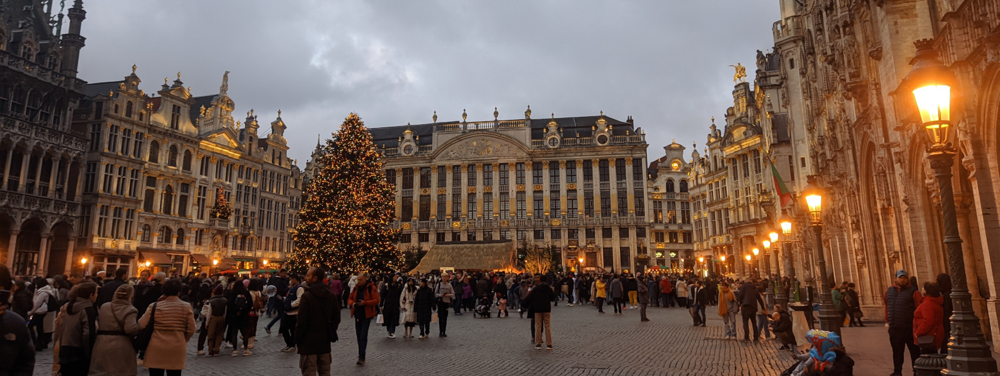
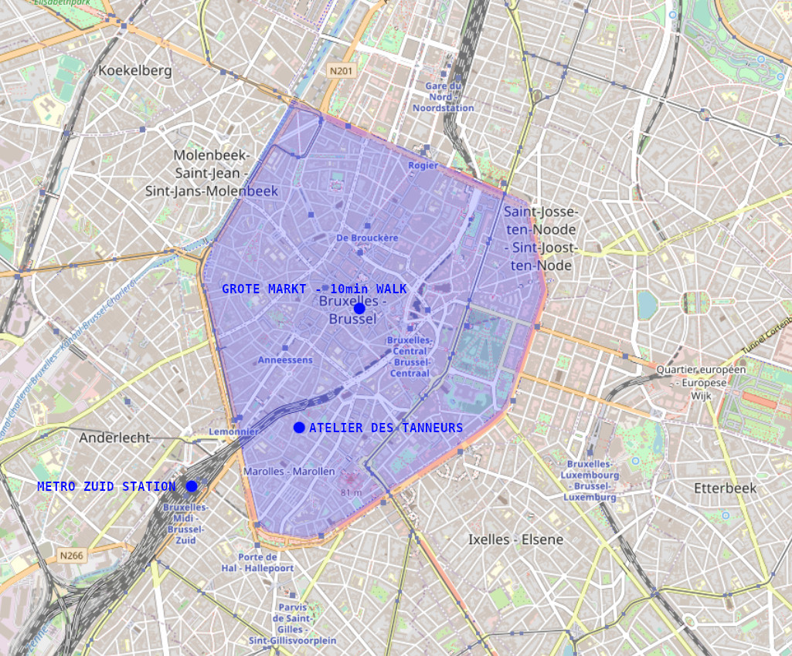

# {{page.title}}

{{page.description}}

The [FreeCAD project association (FPA)](https://github.com/FreeCAD/FPA) is organizing a meeting day in Brussels, Belgium, one day prior to [FOSDEM 2023](https://fosdem.org/2023/). The event will be held at [Atelier des Tanneurs](https://www.ateliersdestanneurs.be/), on Friday, February 3rd from 9:00 to 17:30. The event is open to anyone interested in meeting other FreeCAD developers and users and discuss about FreeCAD. No registration is required.

## The Program

The day will be organized as an [unconference](https://en.wikipedia.org/wiki/Unconference). People attending the event will propose and decide what to do on premises. Just show up anytime, and see what's happening! Even better, if you wish to show or discuss something, bring your ideas with you. Bring also your computer if you wish to show or share things with others.

## The venue

The even will happen at[Atelier des Tanneurs](https://www.ateliersdestanneurs.be/), located [rue des Tanneurs 60A in Brussels](https://goo.gl/maps/G3syvCLQA6SraZ3r9), inside the city centre inner ring. It is easy to reach by foot (10 minute walk from [Brussels grote markt](https://goo.gl/maps/ayZELhBRmnzah25L6) or by public transport (10 minutes walk from [Zuid Station subway station](https://goo.gl/maps/mGU4bfU2nfv2nPL36).

We'll dispose on a room with tables and seats for about 30 people, wall sockets (220V, EU model) and a projector, and an attending space with coffee, drinks and snacks. The space will be open and available to us from 9:00 to 17:30.

## Come with your family!

There are many restaurants with all kinds of food very close to the location, including a traditional [frituur](https://goo.gl/maps/TAKuTJHpk275hvyX8). If you never tried belgian fries before, that's a must. There are also many interesting sightseeing features of Brussels within easy walking distance, such as the [grote markt](https://goo.gl/maps/eQJjtyND87kLWRLw8) heritage site and its adjacent streets, and several pieces of remaining medieval walls. Some of us at the venue will be happy to indicate things to do around the location.

## Travel grants

The FPA is offering travel grants to help FreeCAD developers and community members attend the FreeCAD meeting day and [FOSDEM 2023](https://fosdem.org/2023/). Be sure to check the [requirements](FOSDEM_travel_grants.md) if you are interested in getting a grant.

## Streaming and showcasing

There will unfortunately be no live streaming at the event, because of the difficulty and costs involved in doing it right technically, and also because the unorganized, unconference nature might turn the stream uninteresting. However, we'll do our best to catch the best of the action with recordings and interviews, to be published later on, so if you can't attend the meeting, we'll try our best to give you a good idea of what happens there.

## Goodies

There will be stickers, and t-shirts sold (the cost price is around 10€, plus any contribution you might wish to give to the FPA). As we'll print a limited number of t-shirts, please [reserve yours](https://forum.freecadweb.org/viewtopic.php?p=648891#p648891) to be sure you have one.

## Help wanted

We will need people wanting to help with organizing the unconference, welcoming people, and record video interviews during the day. If you think you can help with any of these during the event, please [reach to us](https://forum.freecadweb.org/viewtopic.php?p=648891)!

## Thursday night

For who will already be in Brussels the night before, we plan to meet for food and drink in a cool place (to be announced) in the city centre. Please [reach](https://forum.freecadweb.org/viewtopic.php?p=648891#p648891) if you are interested in joining, so we can book a table accordingly.

## HSBXL byteweek

The [Brussels hackerspace](https://hsbxl.be) organizes a [byteweek](https://hsbxl.be/events/byteweek/2023/) during the week prior to the FOSDEM. FreeCAD will participate on [Thursday, February 2nd, from 10AM to 6PM](https://hsbxl.be/events/byteweek/2023/2023-02-02/), and several developers will spend a day coding there. Feel free to join!

We look forward to meeting you in Brussels!

[Add to calendar](../freecad_events.ics)

*Added on 2022.12.28*
