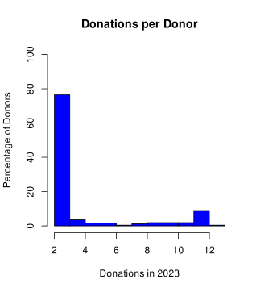
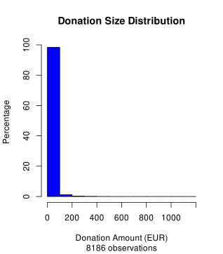
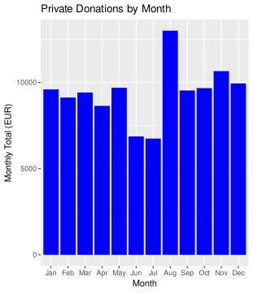
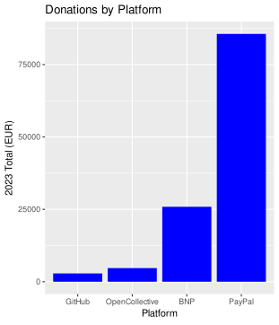
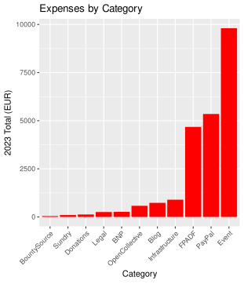

# 2023 Annual report and 2024 plans

Report of the 2023 activities of the FPA and plans for 2024

## Word from the chair

2023 has been our true start. In 2022 we were still trying to find our marks and understand the problems we were facing. This year, we have actually started to do productive work. We defined plans, goals, and we spent money, both on developers and to advance on these goals. And things have advanced spectacularly. Feedback we received from users is overwhelmingly good. We feel we are advancing on getting all that groundwork handled, that is needed to have FreeCAD thrive and reach new areas and bring new or renewed interest to both existing and new users, while making the development environment a better place so developers, new one as well as veteran ones, feel better and can do their magic as comfortably as possible.

## 2023 report

2023 is the second full year of functioning of the [FreeCAD project association (FPA)](https://fpa.freecad.org) and we are thrilled to report that nearly all of the challenges, problems, wishes, goals that we identified [at the end of last year](https://fpa.freecad.org/annualreports/2023.html) have been attacked, handled, and, if not completely solved, well advanced.

### Spending money

We have analyzed, discussed, and set up plans to **better spend money**. We have undertaken a [survey to find out why our current grant program did not get much traction](https://github.com/FreeCAD/FPA/blob/main/reports/2023_09_27_Prokoudine.md), and we have set up a brand-new grant program, which is almost ready and will launch in the coming weeks. In the meantime, we also attributed a [lot more and larger grants](https://fpa.freecad.org/programs/fpadf-announcement) to developers. The goal is to spend all the money we get, and the largest possible part of it in development and developers. We are getting there.

### VAT

We have **upgraded the FPA to get VAT**. With this, the FPA is now able to buy goods and services without paying the VAT, but also to perform commercial operations such as selling services. This of course must always remain inside the non-profit goal of the FPA, and these operations must always and only be done to help the FreeCAD project and its developers. But it would allow the FPA, for example, to serve as an intermediary between developers and companies.

### Strategic goals

The FPA has defined, discussed and advanced on a series of **strategic goals** that we wanted to incentive, with the idea of a version 1.0 in mind: 

* Resolution of the Toponaming issue
* Having a default Assembly workbench
* Working on better accessibility and UX
* Having a FreeCAD-wide Materials system
* Better documentation

We are pleased to announce that these four topics have enormously advanced over last year. A FreeCAD version 1.0 is closer than it has ever been. This has been done through the action of many different groups, bodies and programs, always under the coordination of the FPA, such as [Ondsel](https://ondsel.com), a company developing commercial features using FreeCAD, a new group of FreeCAD users, that we informally call [the design group](https://forum.freecad.org/viewtopic.php?t=83692), who decided to tackle UX/UI issues, or the [Google Summer of Code](https://summerofcode.withgoogle.com/), in which FreeCAD participated on its own for the first time in 2023. The FPA also issued [several grants](https://fpa.freecad.org/programs/fpadf-announcement) to developers to help pursuing those goals.

### Planned development

One of the goals of 2023 was also to make development more streamlined, predictable, integrated and fast, so developers would have a more comfortable job, see their pull requests analyzed and merged faster, and we could offer FreeCAD users a more predictable release schedule. We also wanted to have more technical discussion around big issues such as the Toponaming resolution, and make the merge process less dependent on particular maintainers, so they could work more comfortably and with less pressure. After a year of having implemented more [meetings](https://www.freecad.org/events.php), more tools to have [decisions taken collectively and transparently](https://github.com/FreeCAD/FreeCAD/projects?query=is%3Aopen), the amount of developers taking part of those processes, the speed of handling pull requests, and the feedback we received of FreeCAD users has been overwhelmingly positive.

### Transparency

We made more progresses in having each and every bit of the FPA processes fully transparent. The [FPA meetings](https://www.freecad.org/events.php) are now fully public and can be attended by anyone, and all the decisions, reports, and every action the FPA takes is [published](https://fpa.freecad.org/). Some last pieces remain hidden, mostly to protect the privacy of FPA members, but we're studying ways to solve that too.

### Maintenance and support

The FPA is also trying to ease the life of FreeCAD developers. In 2023, the FPA has [contracted Adrian](https://fpa.freecad.org/programs/fpadf-announcement) to work on releases management, support build and publishing platforms such as Conda or the Ubuntu PPA, and give general support on issues and pull requests. FreeCAD releases have finally become something easy and reliable. And a spoiler: we also just contracted another FreeCAD community member to help working through the giant pile of issues. Hopefully, more and more, developers will be able to spend their time on what they like and do best: coding!

### In-person meetings

In 2023, the FPA has organized two meetings, one in [Vancouver](https://blog.freecad.org/2023/05/24/freecad-hackathon-11-13-august-2023/) and one in [Brussels](https://blog.freecad.org/2024/02/13/the-freecad-day-2024/) where FreeCAD developers could meet, share ideas and experience and do some coding together. Meeting your FreeCAD buddies in-person, after years of collaborating online, is tremendously useful, inspiring and also a lot of fun. We all got out of there with our heads full of ideas, and a renewed impulse to continue working on making FreeCAD the best thing ever. We're on the right track, and we're all doing that together.

### New members

The FPA [roster](https://fpa.freecad.org/handbook/people/roster.html) has expanded, a few members have chosen to remain inactive, while new members have joined. The chirman has also been reelected for a 2-year period.

### Financial Report

2023 was our first year of formal double entry bookkeeping.  This has provided greater insight into our financial situation and allowed us to easily comply with regulations.

In 2023, the FPA received donations of just over **€100,000**.  This amount exceeded our expectations.  The donations continue to come mainly from individuals in small amounts (less than €10).  We did note an increase in recurring donations from individuals.  Support from businesses increased in 2024, but remains a small portion of total revenue.

The FPA used four donation platforms in 2024:

* direct deposits to our bank account
* transfers to our PayPal account
* Github donations
* donations via Open Collective.

As far as we can determine, the BountySource donation platform has ceased operations and the FPA expects to write off our BountySource balance of approximately 4,0000 USD in 2024.  We have engaged a lawyer to pursue our rights in this matter, but we are not optimistic about a successful resolution.

The FPA spent approximately **€26,000** in 2023 with the majority being spend in the second half of the year.

### Debts

As of the end of 2023, the FPA had a total debt of €20.  This amount represents an accounting error related to mentor stipends for the Google Summer of Code and will be corrected in the January 2024 accounting period, leaving the FPA completely debt free.

### Non-financial Assets

The FPA owns the [freecad.org](https://freecad.org) domain and and a [trademark](https://fpa.freecad.org/trademark.pdf) that helps us to protect the FreeCAD name and logo against unfair or malicious use.

### Accounting report

* [Accounting report](../accounting/2023accounting)

### AISBL Annexe 8 financial reports

* [Etate du Patrimoine](./_images/Etatdupatrimoine2023.html)
* [Etat des Recettes et des Depenses](./_images/EtatdesRecettesetdesDepenses2023.html)

## Plans for 2024

### FreeCAD 1.0

All of us have dreamed for years of the moment we could call FreeCAD "stable and good for production", which in the software world is when you tag your software with the mythical 1.0 version number. Although most FreeCAD users will say it has been stable and good for production for years already, FreeCAD developers have always had very precise goals in mind that would mean version 1.0: The solving of the Toponaming issue, and a built-in Assembly workbench.

Both these issues are now being worked on by a large number of experienced developers. At the FPA level, we will continue to support this effort as best as we can, mainly by funding developers working on these two areas, and we have high hopes that we can reach the mythical milestone this year.

### New grants program

In 2023, the FPA has launched ans supported a [research](https://github.com/FreeCAD/FPA/blob/main/reports/2023_09_27_Prokoudine.md) to find out why our grants program had so little success, and what other projects were doing that was successful. This year, we will be launching a brand-new grants program, that has been built based on that research. Hopefully, we will be able to reach further and help more developers to spend more time and work more comfortably on FreeCAD, and also to find people willing to take on tasks that will help all developers, such as triaging bug reports, writing documentation or managing web services.

### More participation to events

In 2023 we had two real-life meeting events where FreeCAD developers and users could meet. In 2024, we want to continue that, because it is a great way to put new energy into the project, but also reach to new events, like FOSS events outside the USA - Europe axis, but also non-FOSS events where we could meet new potential FreeCAD users, like CNC/CAM or BIM events. The FPA will therefore seek interested people to send to these events, and build good demonstration material to showcase.

### Documentation

The FPA identified the [FreeCAD documentation](https://wiki.freecad.org) as a precious and somewhat endangered asset of the FreeCAD project. The documentation is too dependent on a complex and complicated to maintain software suite, and should be treated with the same care and efforts as the FreeCAD code itself. In 2023 we have studied several options and possible solutions, and are determined to advance on that path in 2024 and propose working solutions.

### Inclusion, diversity and community care

The end of last year has seen several conflicts arise among the FreeCAD community, and splits happened, with parts of the community not talking to each other, which provoked tensions and stress. In 2024 the FPA is determined to taking special care of the places where the FreeCAD community meets, and put more effort to make sure everybody feels welcome and safe, and that communication flows nicely among everybody. This includes appointing more moderators, setting up better guidelines for everybody, and try to make different parts of the community talk more with each other.

### UI and UX

We have just scratched the surface and yet, people's response to the latest efforts being put in UI and UX refinements in FreeCAD have been overwhelmingly positive. In 2024 the FPA is decided to put more effort in this area: Have more guidelines written, build better opinions by allowing developers to research and educate themselves, and do more polling and feedback collection on new features and UX/UI changes.

### Reach to amazing projects

One of the most thrilling things we saw at [FOSDEM](https://fosdem.org) this year, is how amazing projects like the satellites of the [Libre Space Foundation](https://libre.space) are marvelous examples of what people can achieve with Free and Open-Source software like FreeCAD. There are many more great projects out there that use FreeCAD and that demonstrate better than anything else how powerful FreeCAD is. At the FPA, we want to reach to these projects, and establish better relationships: Help these projects where they need by making a bridge with FreeCAD developers, and showcase these projects to inspire people and convince them FreeCAD is what they need.

### Space and rocketry

Of all CAD applications out there, we also saw that FreeCAD is specially loved by people working with space and rockets. This is a wonderful and inspirational image, something no other CAD application has. We would like to explore that idea and grow more space for that area inside the FreeCAD ecosystem.

### More transparency

The FPA is a tool of the FreeCAD community. We are decided to go further in making that crystal clear, and make everything the FPA does public. In 2024, we will try to turn the FPA decisions process, which is the last piece still happening behind closed doors for privacy reasons, fully public too.

### Administrative provisions

We expect 2024 to be even busier than 2023. We plan therefore to take some additional measures like:

* Hiring an accountant to handle Belgian reporting requirements, such as tax returns and VAT handling. Up to now, the FPA members have done all the accounting tasks themselves. Hiring an external accountant, however, will help to ensure that the FPA makes no accounting or tax errors, and will allow the FPA to keep functioning even in case of large changes among FPA members.
* Establishing a reserve fund to protect against unplanned expenses.

### 2024 Budget Estimate

#### Income
  
We expect our 2024 income from all sources to be higher that 2023, just as donations in 2023 were higher than 2022.  Projecting 2023 Q3 and Q4 revenue across 2024, we should see an income of over €100,000.

#### Expenses
  
We increased our spending in all areas in 2023, particularly in the second half of the year, and expect this to continue in 2024.  We improved our handling of grant proposals and our approach to soliciting grantees in 2023, although we did not reach planned spending levels. The lessons learned in 2023 will improve our ability to meet spending targets in 2024.
  
Projected spending in 2024:
  
* FPADF - €50,000
* Event support - €10,000
* Reserve fund - €20,000
* Infrastructure - €5,000
* Education Grants - €5,000
