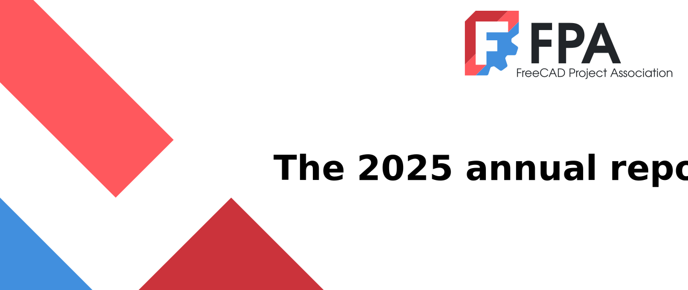

# 2024 Annual report and 2025 plans

This document contains a report of the 2024 activities of the [FreeCAD project association](https://fpa.freecad.org) (FPA), as well as a plan for 2025. The FPA is a non-profit association formed by core FreeCAD developers to manage donations received on behalf of the community and zeal to maintain and develop the FreeCAD project.

### Foreword

2024 was a very active year for the FPA. Founded in late 2021, 2024 was the FPA's third full year of activity. For the first two years of the organization's existence, developing strategies for spending the donations we were receiving in a responsible and useful manner was a key area for growth (we realized how hard it actually is to spend money!). In 2025, with the re-launch of the FPA Development Fund grant program and the creation of several ongoing support positions, spending is finally on track, roughly matching the donations received in the previous year. This spending not only benefited the direct recipients of the funds, but much of it was directed towards projects that benefited *all* developers, paid and volunteer alike.

FreeCAD is a project by users, for users. The reason it exists and develops is because users take part in its development. It is part of our mission at the FPA to keep that process healthy and enjoyable, and for users to always feel it is *their* tool.

Paid development also brings in new people, new ideas, a new development pace, and exciting new perspectives. This is something everyone in the project is learning to work with, and the FPA endeavors to use its fund in ways that ultimately benefit everyone who uses FreeCAD.

The race to finish and release version 1.0 of FreeCAD was a hectic one, consuming developers' time for most of the past year. The FreeCAD community processed, reviewed, and merged an huge number of contributions. Everyone sought to make the release as perfect and powerful as possible, while still actually getting to the finish line, and making FreeCAD 1.0 a reality. The FPA contributed by funding grants in several key areas (such as mitigation of the topological naming problem), and creating support positions such as a paid "bug triager" to help manage the large volume of bug reports.

For next year, the FreeCAD development team wants to take a slower pace, and concentrate on solidifying everything, refactoring, refining development processes, and keeping FreeCAD as the trustable tool we have all come to love. The FPA will support this through funding in four key focus areas outlined later in this report.

Thanks to everybody who has helped build what FreeCAD is today: the most complete and powerful Free, Open-Source 3D CAD program available.

## 2024 report

### Version 1.0

The major achievement of 2024 is without a doubt the release of FreeCAD version 1.0. It took a huge effort from the whole community, large parts of new code and functionality were built, hundreds of bugs were fixed during an extended, six-month-long feature freeze, and the reception to it is overwhelmingly positive.

Although this was clearly a whole-community effort, the FPA is proud to report it has done its part to help the effort by helping to refine the requirements for the release, and funding development in key areas such as toponaming mitigation or UI issues. See the grants section below for more details, and see the [official announcement](https://blog.freecad.org/2024/11/19/freecad-version-1-0-released/) for more details about version 1.0.

### FPA top 5

At the beginning of 2024 the FPA identified five major focus areas for the coming year. Although of course none of them can be called "done", as nothing is ever really "done" in the Free and Open-Source world, we are proud to report that all have advanced significantly:

* **Mitigation of the Topological Naming Problem (TNP)**: The work originally started by developer [Realthunder](https://github.com/realthunder/FreeCAD) as part of his "[LinkStage3](https://github.com/realthunder/FreeCAD)" fork has been merged into FreeCAD, thanks first to an organizing effort by the team at Ondsel, then by a continuous effort led and sponsored by the FPA to finish the merge, and implement a comprehensive test suite to make sure everything works. Although that does not means all the problems are gone, FreeCAD now has a solid mitigation solution in place. Developers should now be able to use it to address specific remaining TNP issues that are still encountered.

* **Integrated Assembly workbench**: Although FreeCAD could already count on several very good 3rd-party assembly add-ons, looking at other CAD packages demonstrated that having a basic integrated assembly feature was the industry standard. Actually implementing an integrated assembly workbench was complicated by a lack of LGPL 2.1-compatible 3D constraint solvers. Again thanks mainly to Ondsel who gathered the needed resources and people, FreeCAD now has such a solver, and a default, included assembly workbench that uses it. The role of the FPA here has only started, as we continue to fund initiatives to develop this assembly workbench.

* **Improved accessibility and user experience (UX)**: The FPA has been active in setting up a Design Working Group, funding that group to upgrade their knowledge of UX questions, and starting to participate and write about UX. The idea here is not to try to "solve" anything, as we understood such thing does not exist, but rather to get everybody who contributes to FreeCAD to educate them about common guidelines and to use them. Thanks to that effort, we have already seen a tremendous improvment of the FreeCAD UI. The work needs to continue, of course!

* **Having a FreeCAD-wide Materials system**: An integrated materials system that is used throughout FreeCAD, by all the different workbenches, and that could handle all different use cases (physical properties, aspect properties, or even rendering properties) is now a reality. Although this has been a community effort, and more precisely nearly a one-man show thanks to the incredible effort of developer [Dave of DavesRocketShop](https://www.davesrocketshop.com/), the FPA helped by giving his work the attention of other developers and making its inclusion into the FreeCAD code as smooth as possible.

* **Better documentation**: The FPA has pursued different efforts to make the documentation better, by exploring different forms like the [developers handbook](https://freecad.github.io/DevelopersHandbook/), giving grants to people to work on the documentation, or upgrading the [FreeCAD manual](https://wiki.freecad.org/Manual) for version 1.0. We have also explored different options to make our wiki documentation better and easier to translate and keep in sync with FreeCAD versions. This is of course an ongoing work, much more needs to be done, but we are on the good track.

### Developer grants

The FPA has awarded in 2024 a total of USD 82 350.00 to developers, some through the [grants program](https://fpa.freecad.org/programs/fpadf-announcement), where developers propose a job themselves, and some through direct [job calls](https://fpa.freecad.org/programs/job-offers) where the FPA proposes and seeks interested people. Some of the jobs below are still under way. Find more details and the full proposals on the [grants proposals repository](https://github.com/FreeCAD/FPA-grant-proposals/issues):

| Grantee              | Proposal                                                           | Area          | Value    |
| -------------------- | ------------------------------------------------------------------ | ------------- | -------- |
| bgbsww               | Toponaming issue mitigation                                        | FreeCAD code  | USD 4800 |
| CalligaroV           | Toponaming issue mitigation                                        | FreeCAD code  | EUR 3400 |
| marioalexis84        | Bugfixing and electromagnetic system simulations using CalculiX    | FreeCAD code  | USD 4000 |
| bgbsww               | Toponaming issue mitigation                                        | FreeCAD code  | USD 5000 |
| Francisco-Rosa       | Design new components for the FreeCAD library                      | Ecosystem     | USD 5000 |
| jnxd                 | Refactoring Sketcher                                               | FreeCAD code  | USD 5000 |
| Andrianos Karampilis | User manual update                                                 | User docs     | USD 2500 |
| drLite35             | Improve the FreeCAD API documentation                              | API docs      | USD 4000 |
| pieterhijma          | Improve C++ API Documentation                                      | API docs      | EUR 8000 |
| bgbsww               | Toponaming issue mitigation                                        | FreeCAD code  | USD 5000 |
| ipatch               | Update homebrew-freecad tap                                        | CI and builds | USD 2000 |
| bgbsww               | Support debugging FreeCAD C++ and Python from CLion and VSCode     | FreeCAD code  | USD 1500 |
| pieterhijma          | Research Variant Parts                                             | FreeCAD code  | EUR 8000 |
| oursland             | CI Hosting Research Proposal                                       | CI and builds | USD 500  |
| FlachyJoe            | Bugfixes for v1.0                                                  | FreeCAD code  | USD 1000 |
| Reqrefusion          | Recommendations and proposal for the improvement of documentation  | User docs     | USD 3000 |
| pieterhijma          | Improve User Experience of VarSets                                 | FreeCAD code  | EUR 8000 |
| Amrita team          | Content and Pedagogy Development for Teaching and Learning FreeCAD | FreeCAD code  | USD 6000 |
| Obelisk              | Modernize, revise FreeCAD Art Guidelines and Icons                 | UX and design | USD 1750 |
| kadet1090            | Unified Transparent Previews                                       | UX and design | EUR 1500 |

### FreeCAD development ecosystem

The FPA has put many efforts into bettering the general ecosystem, tools and environment for developers. Part of the job of the FPA is to support the wider community of people who contribute to FreeCAD, not only by paying grants to developers, but also by putting things in place that help all contributors, paid or not paid, to do their job better, and, even more important, to have fun while doing it. We all work on FreeCAD mainly because it is enjoyable, and at the FPA we want to make sure this continues and gets even better. To that aim, we started or continued different initiatives:

* **Bug triage maintainer**: The FPA now funds a bug triage maintainer, [Max](https://forum.freecad.org/memberlist.php?mode=viewprofile&u=56782), who is doing an incredible job in keeping the issues list active, clean, and making sure all submitted problems get the needed attention. There is now literally a "before Max" and "after Max" at FreeCAD.

* **Release maintainer**: The FPA continued funding and extended the role of [Adrian](https://forum.freecad.org/memberlist.php?mode=viewprofile&u=19302) as a release manager. Adrian is now taking care of all the packages and installers on all platforms, making sure FreeCAD works everywhere, and is also taking care of bugfix releases (these minor releases that are done from time to time after main releases, to fix the most annoying bugs).

* **Working on the forum and community guidelines**: As the FreeCAD community grows, community problems tend to increase. The FreeCAD forum (and other places where FreeCAD community members gather) sometimes suffer from members not behaving the friendly way we would like to encourage. This has made some potential new members avoid the forum because they do not see it as a safe or friendly enough place. Although this is a difficult question where there is no perfect solution, the FPA is working to develop possible solution strategies. Among other things, we have worked to improve the [community guidelines](https://www.freecad.org/codeofconduct.php), made it easier for people to find who to talk to in case of problems, and are trying to get more forum moderators to help alleviate the load on the shoulders of the few heroes who volunteer to do that job.

### Conferences and meetings

In 2024 the FPA organized two meetings where developers and community members could meet in person: The [FreeCAD day 2024](https://blog.freecad.org/2023/10/31/fosdem-freecad-day-and-hackathon-2024/), held in Brussels in January (alongside the Free and Open Source Developer Meetup, FOSDEM), and a [second one](https://blog.freecad.org/2024/06/14/announcing-the-freecad-2024-north-american-meetup/) in Springfield, Illinois, in July. We see these events as highly beneficial for the project, as the exchange of ideas and the user feedback that occur in in-person meetings is always highly valuable.

### Financial report

The FPA is in an even stronger financial position than it was a year ago.  As of 2024-12-31, we have over €200,000 in assets and only a small debt of €2,000 for quarterly VAT charges (which was retired in early January 2025). Donations were almost double 2023, while spending increased by almost 400%.

|             | 2023    | 2024    | Delta  |
| ----------- | -------:| -------:| ------:|
| Assets      | 133,000 | 211,000 | 78,000 |
| Liabilities | 0       | 2,000   | 2,000  |
|             |         |         |        |
| Receipts    | 106,000 | 186,000 | 80,000 |
| Spending    | 26,000  | 99,000  | 73,000 |

We continue to rely on PayPal, GitHub, OpenCollective to collect and forward donations to FreeCAD. As noted in last year's report, at the end of 2024 we wrote off as unrecoverable approximately €4,500 in donations held by BountySource due to the bankruptcy of its parent.  

We also receive direct deposits to our account at BNP Paribas 

There was a noticeable upturn in donations at the end of 2024. Hopefully this continues in 2025.

As usual, our spending concentrated on grants, events and maintaining our on line presence.

#### Regulatory Reports

As a micro-AISBL, under Belgian regulations, the FPA is require to produce two financial reports each year.  These reports are described here: ["Annexe 8 : Schéma des comptes annuels des associations et fondations qui tiennent une comptabilité simplifiée."](https://www.cnc-cbn.be/fr/node/2247).

* [L'Etat Du Patrimoine](../images/2025Report/etatdupat_editted.html)
*[L'Etat des recettes et dépenses](/images/2025Report/etatdesrecetdep_editted.html)

#### Financial goals for 2025:

* hire a bookkeeper/accountant
* grow reserve accounts to maintain a level of 20% of assets
* improve tracking of spending against budget
* improve payables handling

### FPA membership changes

In 2024, the [FPA roster](https://fpa.freecad.org/handbook/people/roster.html) has seen a few changes: [obelisk79](https://forum.freecad.org/memberlist.php?mode=viewprofile&u=36480) and [oursland](https://forum.freecad.org/memberlist.php?mode=viewprofile&u=57910) have joined the team of members, while the current administrators team has been reconducted for another period of 2 years. In total, [54 proposals](https://fpa.freecad.org/handbook/process/decisions.html) have been approved by the FPA members in 2024.

### 2024 Progress Assessment

In the 2023 annual report we laid out several goals for 2024:

* **Increase spending**: In 2023 we struggled to spend our budget. The grant program was in its infancy and developers were generally unaware of the available funding. In 2024 this situation was remedied and we succeeded in spending up to our budget (with some remaining encumberances carrying on to 2025). This is due in part to a much more successful grant program, and in part due to the creation of several recurring positions, as discussed above.
* **Increased FPA participation**: In 2023 we identified a need to increase participation from FPA members to handle the growing demands of the organization. In 2024 several new members joined, and others left, but on the whole the participation of FPA members in meetings and voting deliberations has improved from the levels seen in 2023. This is an area we need to continue to focus on.
* **Reviewers for grants**: In 2023 we expressed the need to form an independent grant review committee. That was formed in 2024, though it was not wholly indpendent of the FPA, with several FPA members serving on the committee, including the chair. In the long term we would still like to increase community involvement in this committee.
* **Forum moderators**: In 2023 we suggested that the FPA could assist with the labor shortage among FreeCAD Forum moderators. While several possible tacks were discussed, no specific action was taken, and this continues to be an area for concern as part of our broader effort to foster a healthy development community.
* **Educational outreach**: In 2023 we mentioned our continuing struggle to engage with the education market, and this continues to be a focus area for 2025. We assisted in the creation of a dedicated forums section for educators, but significant work remains to grow that community and to engage with them to foster the use of FreeCAD in educational contexts.

## 2025 plan

With the release of FreeCAD 1.0 in late 2024, the FPA began evaluating what the next areas of focus for funding initiatives should be. After polling the community and collating the results, a new set of priority areas was identified. These priorities will be used to evaluate grants and to guide the development of new recurring funding projects to support FreeCAD. 

### FPA top 4

For 2025 the FPA has identified four key focus areas that we particularly encourage developers to focus their efforts on, and that will be prioritized for grant funding.

#### 1. FreeCAD’s position within the larger FOSS ecosystem

FreeCAD depends on many other Free, Open Source Software (FOSS) packages. Additionally, FreeCAD's users often use FreeCAD in conjunction with other FOSS tools. The FPA
would like to improve FreeCAD's relationships with these packages by directly supporting development, meetups, and other collaborative efforts. For example, FreeCAD is
currently dependent on packages such as OpenCASCADE, Coin3D, and Qt: FPA funding can be used to develop bug fixes and features for these projects. FreeCAD users
often work with other packages such as KiCAD and OpenFOAM, and development of improved interoperability through Addons or directly in FreeCAD can also be supported by
FPA funding. These lists of software are by no means exhaustive, and development work on other related projecs is also eligible for support. In addition to direct
development, it is often beneficial to find ways to directly interact with the development teams of these other related projects, so FPA funding can be used to support
things such as meetups, conferences, dedicated online gathering places, etc.

#### 2. Developer experience and effectiveness

Improving the development experience and developer effectiveness is critical to the long-term health and stability of the project. There are many different facets to this
focus area, but broadly it can be broken down into several main components:

1. Improve onboarding
   1. Documentation
   2. Mentorship
2. Incentivize development in key areas
   1. Strategic features as identified by various working groups (e.g. the Design Working Group and CAD Working Group)
   2. Testing
3. Improve code quality and readability
   1. Adding tests (unit, regression, integration, etc.)
   2. Refactoring
   3. Modernizing
   4. More human testing of pull requests
   5. Better separation of business logic from UI
4. Keep merge process lean, fast, and predictable

The FPA will prioritize funding of grants that fit into one of these areas, and will work with Maintainers and Developers to encourage focus on these targets across the
broader development community.

#### 3. User Experience

User experience is common pain-point in FOSS, and in FreeCAD in particular. Over the many years of its development many different individuals have worked on parts of the
overall user experience, but only recently has a dedicated group formed to focus on the unification of these disparate pieces of the FreeCAD ecosystem. "User experience"
encompasses more than use the user interface of the software itself, and the FPA will focus on improving many different aspects in the coming year:

1. Pre-software experience (forums, website, social media)
2. Bug reporting and resolution
3. UI
4. Standard workflows
5. Documentation
6. Typical CAD workflows / CAD advisory group
7. Better support of multi-document assemblies
8. Support of collaborative document creation
9. Training/Certification

#### 4. Standards compliance

To make FreeCAD more useful in professional contexts, standards compliance is critical, and the FPA continues to foster development in this area, including by purchasing the
relevant standards and stewarding developer access to them. These include particular focus on Geometric dimensioning and tolerancing (GD&T) and Industry Foundation Classes (IFC),
but can extend to other important standards as identified by relevant working groups such as the CAD Working Group.

### Grant program

The FPA Development Fund grant program is one of the main mechanisms that the FPA uses to distribute funding to individual developers. While FreeCAD is nearly 100% volunteer-developed, the FPA aims to encourage and support FreeCAD's development team by spreading collected donations amongst the group to defray some of the costs of contributing time to the project. At the current budget level the FPA cannot fund full-time development on FreeCAD, but can give individuals small amounts of money to contribute to their work.

In 2024 we successfully relaunched the grant program, and FPA members voted to approve total grant funding in excess of €85.000. While this represents a substantial, and much-needed, increase in funding allocation, it also demonstrated that the current structure of rolling grant applications was difficult to budget: €50.000 had been allocated for the program. While this overrun was not problematic from a cashflow standpoint, it points to a systemic flaw in the way grants are allocated.

A secondary problem with the grant program was its unpredictable timing. Personnel issues led to high variability in the amount of time it took a grant to go from initial presentation to final funding. 

Finally, because of the rolling schedule throughout the year, it was impossible to effectively prioritize grants. Each was reviewed independently as it arrived, which didn't allow comparison between the grants in order to manage focus areas.

To address these issues, the grant program is being restructured for 2025: rather than operating on a rolling basis, the 2025 program will have four deadlines throughout the year, with a set review timeline following each deadline, and a set funding budget of €20.000 for each period (€80.000 total budget). This will allow explicit comparisons of one grant to another, and the selection of those that best fit the FPA's funding priorities. This will lead to an inevitable increase in turnaround time for most grants as they sit waiting for the deadline to arrive, but should prevent the budget overrun we experienced in 2024, and will mitigate the other problems mentioned above.

### Financial plan

Spending Forecast

|                            | 2024 Actual | 2025 Planned | Delta % |
| --------------------------:| -----------:| ------------:| -------:|
| FPADF awarded in 2024      | 40,500      | 41,050       | 1.4%    |
| FPADF to be awarded        | 0           | 80,000       | 100.0%  |
| Ondsel Onward              | 0           | 40,000       | 100.0%  |
| ecosystem Support          | 14,700      | 24,000       | 63.37%  |
| new ecosystem resources    | 0           | 17,000       | 100%    |
| blog/Website               | 9,200       | 13,200       | 43.58%  |
| Events                     | 16,500      | 10,500       | -36.46% |
| Remuneration               | 4,600       | 5,000        | 8.70%   |
| Financial Institution Fees | 8,900       | 10,000       | 12.46%  |
| Contributions to reserves  | 20,000      | 10,000       | -50.0%  |
| Total                      | 114,400     | 250,750      | 220%    |

Revenue Forecast

In 2024, we received some large donations that we do not expect to be repeated in 2025.  In light of this, we are forecasting a modest increase on a base of our 2024 receipts less extraordinary items.

|              | 2024 Adjusted | 2025 Planned | Delta % |
| ------------:| -------------:| ------------:| -------:|
| Donations In | 145,000       | 160,000      | 9.1%    |

While we plan on spending more than we take in in 2025, we have more than sufficient spendable assets to cover planned spending.
