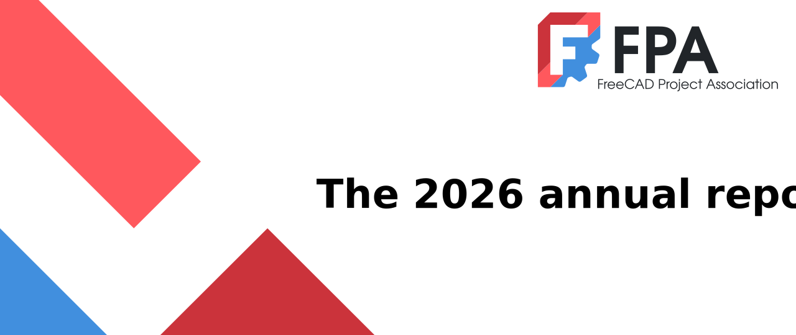
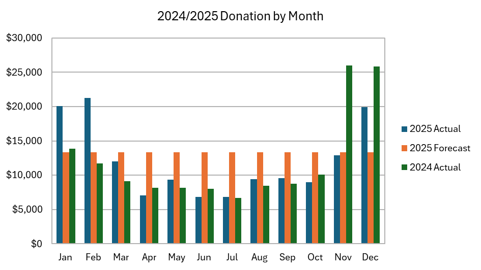
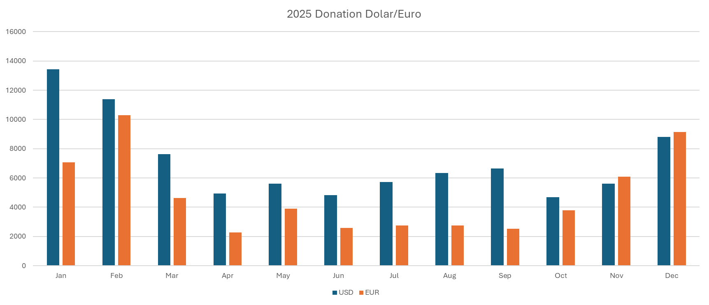
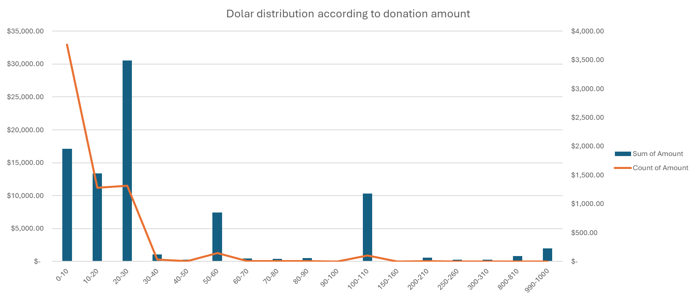
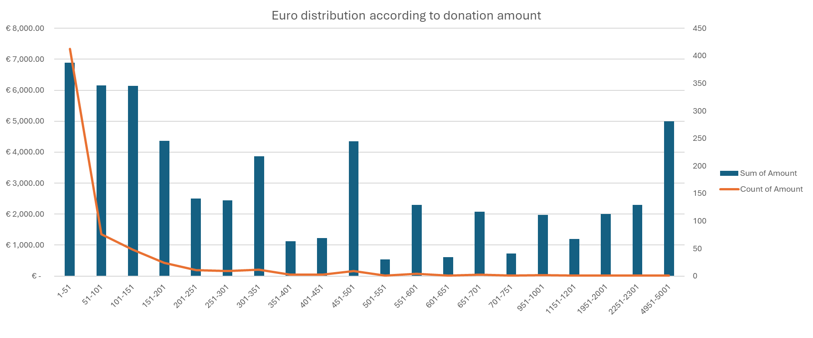
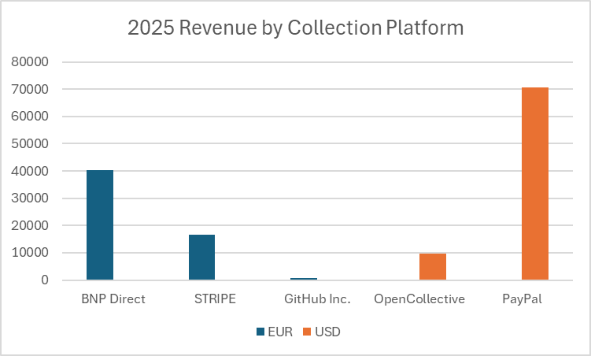
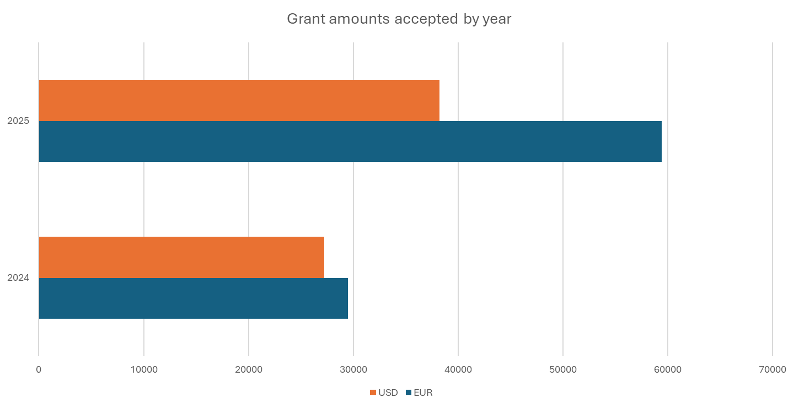
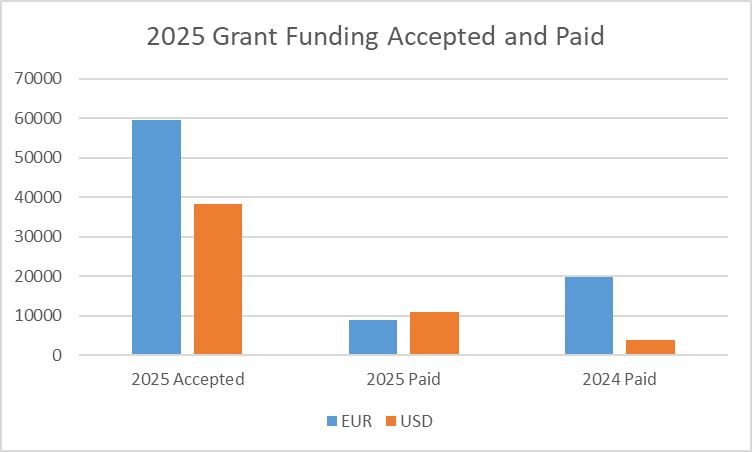
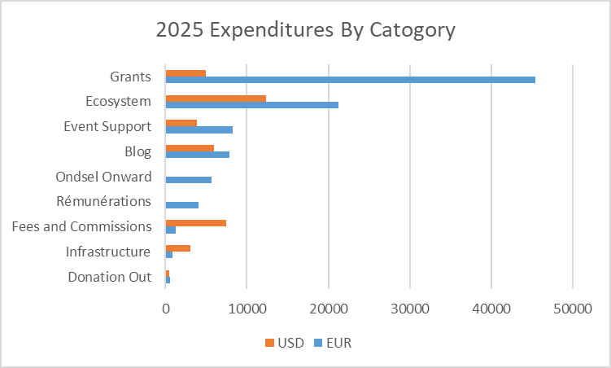
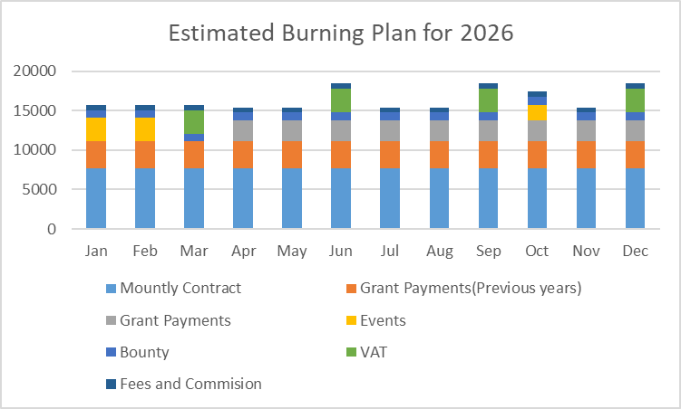

# FPA yearly report 2025 and 2026 plan

Prepared by Chris Hennes, Turan Furkan Topak and Yorik van Havre, reviewed by Joe Sardos

This document contains a report of the 2025 activities and finances of the [FreeCAD Project Association AISBL](https://fpa.freecad.org) (FPA), as well as a financial plan and budget for 2026\. The FPA is an international non-profit association based in Brussels, Belgium formed by core FreeCAD developers with the primary goals to manage donations received on behalf of the FreeCAD community to facilitate improved maintenance, protection and development of the [FreeCAD](https://freecad.org) project.

## Foreword

2025, our fourth year of existence, has been a busy year for the FPA. We tried to scale things up, and we were finally able to stick to our budget and efficiently spend all the money we had planned to spend (we were actually a bit too good at it and happened to spend a bit more than planned. Even so, we consider this an achievement\!). We maintained all running programs, such as development grants, blog activity, release management, and bug triaging. In addition to those, the FPA also introduced several exciting new programs, such as a bugfixes bounty program, and opened new contracts to better serve FreeCAD’s community of developers and users alike.

2025 has also seen some turmoil within the FreeCAD community, with several long-term developers leaving the project or community members criticizing some of the actions of the FPA. We have listened to those criticisms and adapted operations to better support the expectations of our community, while also maintaining a clear direction and purpose: to support FreeCAD’s broad and diverse community by focusing on actions that benefit the community at-large.

The income collected by the FPA is stable, consisting exclusively of donations, which predominantly comes from individuals, but also includes a small yet growing contingent of professional organizations and companies. We received in 2025 more or less what we expected to receive, which is relatively stable and consistent year after year. See the financial report below for more details.

Next year, we plan to consolidate and continue what we are doing while also making a few adjustments as we continue to refine our processes. Read the full plan for 2026 below.

As usual, it is always worth noting that the FPA strives for maximum transparency and openness. All of our [meetings](https://www.freecad.org/events.php) are open to the public, and all of our actions are [publicly documented](https://fpa.freecad.org/handbook/process/decisions.html). Anyone from the FreeCAD community is welcome to participate and voice their opinions or concerns.

Finally, we would like to express a big thank you to all of the donors who have funded the FPA’s activities in improving the FreeCAD project this past year. Each Euro or Dollar helped us to carry on the FPA’s mission, helping the FreeCAD project to mature and thrive.

Below, you will find a more detailed report of the actions undertaken in 2025, and our plans for 2026\.

## 2025 Report

### 2025 top five

In 2025, we elected five key areas we wanted to place emphasis on:

* **\[1\] Improve FreeCAD’s position within the larger FOSS ecosystem**, we initiated several things:

  * [Hired an individual as a liaison between FreeCAD and OCCT](https://github.com/FreeCAD/FPA/tree/main/reports/occt-liaison), FreeCAD's core geometry engine.
  * Established formal contacts and explored [collaboration with similar projects like KiCAD](https://fosdem.org/2026/schedule/event/JAH78J-kiconnect-one-year/)
  * Increased efforts into improving package distribution options such as snap or flatpack, and refined the packaging tools (ie. supporting the pixi build system).

* **\[2\] Improve developer experience and effectiveness**, several areas saw improvement.

  * As previous years, [Max has been doing a magnificent job at handling, triaging and categorizing issues](https://github.com/FreeCAD/FreeCAD/issues).
  * Several community members are now also maintaining [projects and boards](https://github.com/FreeCAD/FreeCAD/projects?query=is%3Aopen), tracking specific sets of issues and enhancements.
  * The FPA also opened several positions to support the developers, such as an Addons Ecosystem Coordinator or a Translations Manager.

* **\[3\] Improving user experience**: The intent was to emphasize User Experience (UX) improvement. This has been mostly done by allocation grants to UX-related projects (see the full list of allocated grants below). However, it is clear that the term UX encompasses a broad range of disciplines, is very difficult to judge, and validate or assess. It is challenging to evaluate how particular changes affect overall UX. This is an area which will remain a continual effort of improvement, as developers work with the Design Working Group in effort to make FreeCAD more cohesive, coherent, and efficient.

* **\[4\] Implement a comprehensive FreeCAD-wide materials system**. Now fully in place. Tremendous effort, principally by its main developer Dave, [has been put into this in 2025](https://github.com/FreeCAD/FreeCAD/commits?author=davesrocketshop), even more because it ended up touching much more distant areas than expected, such as all the rendering system of FreeCAD. We can now count on a solid cards system, that can read material information from a series of sources, a GUI to categorize and edit them, and material properties which affect visual appearance in FreeCAD. There is still more work to be done, mainly to propagate this into the more remote areas of FreeCAD, but we believe solid foundations are in place.

* **\[5\] Improving documentation**: We awarded a series of grants that touched the documentation. The [FreeCAD wiki](https://wiki.freecad.org) is where most of the efforts have been directed. It has now a much friendlier, updated theme, but also several features under the hood such as automatic connection to a git repository, a better search system and a better editor. More effort went to documenting the C++ code, something we plan to continually improve.

### Consolidation of processes and transparency

Since the FPA inception, all decisions taken by vote by the FPA members are publicly registered. See the full [list of decisions taken in 2025](https://fpa.freecad.org/handbook/process/decisions.html).

Since mid-2025, we are also producing automatic minutes for all the [Sunday developer meetings](https://github.com/FreeCAD/FreeCAD-developer-meetings/tree/main/Minutes) and [Wednesday FPA meetings](https://github.com/FreeCAD/FPA/tree/main/minutes). Those meetings are all [published on our calendar](https://www.freecad.org/events.php) and free to attend by anyone, and their agendas are also published on the same repositories, so anyone is free to propose topics by making a pull request on those.

### Grants program

The grants program successfully continued in 2025, with 31 grants allocated. It counted with a budget of 60 000 EUR which was almost fully spent.

| Grant Title                                                                                                                                                     | Submitter       | Budget     |
|:--------------------------------------------------------------------------------------------------------------------------------------------------------------- |:--------------- |:---------- |
| [Refactoring Sketcher 2](https://github.com/FreeCAD/FPA-grant-proposals/issues/23)                                                                              | AjinkyaDahale   | 4000 EUR   |
| [homebrew-freecad fix building a mac app bundle using deps based around homebrew](https://github.com/FreeCAD/FPA-grant-proposals/issues/28)                     | ipatch          | 1000 EUR   |
| [\[Lens\] Make Lens Platform Self-Deployable and Cloud-Agnostic](https://github.com/FreeCAD/FPA-grant-proposals/issues/29)                                      | amrit3701       | 6500 USD   |
| [New curves for Sketcher](https://github.com/FreeCAD/FPA-grant-proposals/issues/33)                                                                             | AjinkyaDahale   | 6000 EUR   |
| [Maintenance, improvement and development of new features on the FEM workbench](https://github.com/FreeCAD/FPA-grant-proposals/issues/34)                       | marioalexis84   | 3000 EUR   |
| [Modernizing FreeCAD's Rendering and Selection Systems](https://github.com/FreeCAD/FPA-grant-proposals/issues/35)                                               | tritao          | 4000 EUR   |
| [Multithreading Architecture Improvements in FreeCAD](https://github.com/FreeCAD/FPA-grant-proposals/issues/36)                                                 | tritao          | 2000 EUR   |
| [Pattern tools refactor, unification and additional functionality.](https://github.com/FreeCAD/FPA-grant-proposals/issues/38)                                   | PaddleStroke    | 2000 EUR   |
| [Configuration Space Visualization for Computer-Aided Geometric Design](https://github.com/FreeCAD/FPA-grant-proposals/issues/39)                               | behollister     | 500 USD    |
| [Websites improvements initiative \- Step 1](https://github.com/FreeCAD/FPA-grant-proposals/issues/40)                                                          | marcuspollio    | 4000 EUR   |
| [PartDesign: Extrude Two directions](https://github.com/FreeCAD/FPA-grant-proposals/issues/41)                                                                  | PaddleStroke    | 500 EUR    |
| [Maintenance, improvement and development of new features on the Assembly workbench](https://github.com/FreeCAD/FPA-grant-proposals/issues/42)                  | PaddleStroke    | 3000 EUR   |
| [Maintenance, improvement and development of new features on the Sketcher workbench](https://github.com/FreeCAD/FPA-grant-proposals/issues/43)                  | PaddleStroke    | 3000 EUR   |
| [CAM/BIM: 2D Nesting Tool for FreeCAD](https://github.com/FreeCAD/FPA-grant-proposals/issues/44)                                                                | AbhiramMasna    | 150000 INR |
| [Research ISO GPS / GD\&T for an overall concept as implementation in FreeCAD](https://github.com/FreeCAD/FPA-grant-proposals/issues/45)                        | maxwxyz         | 3000 EUR   |
| [CAM improvements for machining metals](https://github.com/FreeCAD/FPA-grant-proposals/issues/46)                                                               | davidgilkaufman | 3500 USD   |
| [Assembly Solver Interface Abstraction and Alternative Solver Implementation](https://github.com/FreeCAD/FPA-grant-proposals/issues/47)                         | oursland        | 2000 USD   |
| [Update OSH Automated Documentation for FreeCAD 1.0](https://github.com/FreeCAD/FPA-grant-proposals/issues/48)                                                  | pieterhijma     | 2000 EUR   |
| [Promoting Academic and Educational use of FreeCAD via targeted written tutorials](https://github.com/FreeCAD/FPA-grant-proposals/issues/50)                    | concretedog     | 2000 GBP   |
| [Maintenance, improvement and development of new features on the Assembly workbench \- Q3](https://github.com/FreeCAD/FPA-grant-proposals/issues/51)            | PaddleStroke    | 3000 EUR   |
| [Maintenance, improvement and development of new features on the Sketcher workbench \- Q3](https://github.com/FreeCAD/FPA-grant-proposals/issues/52)            | PaddleStroke    | 3000 EUR   |
| [TechDraw: Rework annotation tools \- Repost](https://github.com/FreeCAD/FPA-grant-proposals/issues/53)                                                         | PaddleStroke    | 2000 EUR   |
| [Design System and Style Guidelines](https://github.com/FreeCAD/FPA-grant-proposals/issues/58)                                                                  | kadet1090       | 5000 EUR   |
| [\[LENS\] Enhanced Authentication, Branding Customization, and TrueNAS Integration for Lens Platform](https://github.com/FreeCAD/FPA-grant-proposals/issues/60) | amrit3701       | 12250 USD  |
| [CAM improvements for the Adaptive operation](https://github.com/FreeCAD/FPA-grant-proposals/issues/61)                                                         | davidgilkaufman | 4250 USD   |
| [Sky domes, sun radiations analysis module](https://github.com/FreeCAD/FPA-grant-proposals/issues/62)                                                           | Francisco-Rosa  | 2000 USD   |
| [Selection system enhancements / overhaul](https://github.com/FreeCAD/FPA-grant-proposals/issues/65)                                                            | tetektoza       | 3000 EUR   |
| [Ondsel Lens and Lens addon documentation](https://github.com/FreeCAD/FPA-grant-proposals/issues/67)                                                            | prokoudine      | 1000 EUR   |
| [KiConnect PCB Workbench \[Time Commitment, Ecosystem\]](https://github.com/FreeCAD/FPA-grant-proposals/issues/72)                                              | morganrallen    | 5200 EUR   |
| [Maintenance, improvement and development of new features on the Assembly workbench \- Q4](https://github.com/FreeCAD/FPA-grant-proposals/issues/73)            | PaddleStroke    | 3000 EUR   |
| [Maintenance, improvement and development of newfeatures on the Sketcher workbench \- Q4](https://github.com/FreeCAD/FPA-grant-proposals/issues/74)             | PaddleStroke    | 3000 EUR   |

We also plan to make a few adjustments in 2026\. See the [full 2025 grants report](https://blog.freecad.org/2026/03/01/fpa-grant-program-2025-year-in-review/) for more details.

### New positions

The FPA also opened a few new positions in 2025\. These roles are usually proposed by FPA or FreeCAD community members, discussed during the FPA meetings, and finally put to vote by the FPA members. They are then announced on the [FPA jobs page](https://fpa.freecad.org/programs/job-offers). A selection process follows, which is described more in details on that same page.

Contract roles are always created out of an existing need and considering the maximum benefit for the whole FreeCAD community.

In 2025, we created and attributed the following positions:

| Position                       | Held by     | Description                                                                                                                        |
|:------------------------------ |:----------- |:---------------------------------------------------------------------------------------------------------------------------------- |
| Addon Ecosystem Coordinator    | PhoneDroid  | Coordinates with addon developers and works towards the best possible experience for Addon developers and users of addons          |
| Addon Ecosystem Technical lead | mnesarco    | Develops what is needed to better the environment to develop Addons. Mainly, the Python API and the Addons Manager                 |
| Infrastructure Manager         | kkremitzki  | Manages all the web infrastructure the FreeCAD project depends on, and develops further actions to bring us closer to self-hosting |
| OCCT Liaison                   | pieterhijma | Manages all the OCCT-related bugs, handles them upstream, and manages communication with OCCT people                               |
| Financial officer              | Reqrefusion | The financial officer is responsible for all accounting tasks, like producing reports and handle payments                          |

More details and the full list of current positions is publicly available on the [FPA git repository](https://github.com/FreeCAD/FPA/issues?q=is%3Aissue%20state%3Aopen%20label%3AContract). All the people contracted by the FPA also usually report briefly at the beginning of each Wednesday FPA meeting, and they produce monthly reports of their activities, stored on the [FPA Git repository](https://github.com/FreeCAD/FPA/tree/main/reports).

### Maintainers honorarium

In 2025, after reviewing practices in other open-source projects and in academia, we decided to provide maintainers with a modest level of financial recognition, even if it does not fully reflect the value of their work. Based on this assessment, we launched the [Maintainer Honorarium program](https://fpa.freecad.org/programs/maintainer-honorarium).

Under this program, maintainers receive €200 per month for as long as they remain active, simply in recognition of their maintainer role. This payment is explicitly not a salary or wage. It is intended as a token of appreciation and a tangible “thank you” to valued community members who take on some of the most demanding and responsibility-heavy work in the FreeCAD project.

### Bug bounties program

In 2025, following the successful experimental bounty program [set up for the 1.0 release](https://blog.freecad.org/2025/10/02/first-bugfix-program-payouts-done/). We developed a stable, longer-term [bugfixing reward program](https://fpa.freecad.org/programs/bugfix-rewards-program). This program rewards people fixing bugs in FreeCAD, with an extra incentive if you fix critical bugs. The program already [issued several rewards this year](https://blog.freecad.org/2025/12/19/dec-2025-bug-bounty-update/). We had a lot of discussion about the worthiness of bounties at the FPA, and we are very happy with the way this program is taking off, and have several ideas to extend it further along the way.

### Maintainers honorarium

A [new program](https://fpa.freecad.org/programs/maintainer-honorarium) has also been launched, that rewards active maintainers with a monthly allowance. Having a great pool of maintainers able to dedicate some time to the vast amount of pull requests that get in, is precious for everybody. This initiative aims at providing a little help to these maintainers, to perform a job that is sometimes tiring and thankless.

### Financial report

In 2025, Wandererfan, who had been taking accounting on his shoulders since the FPA inception, retired from his duties and we opened a position to do the accounting and financial work of the FPA. FreeCAD community member and FPA member Reqrefusion, who happens to also be a trained accountant, took on the job.

The FPA also upgraded to the new Belgian legislation and is now accepting e-invoices.

On this chart you can see the monthly breakdown of donations. In 2024, excluding a few large one-off donations such as Ondsel Onward, we received \$144,828. For 2025, we set a target of a 10% increase, which meant a goal of $159,311. However, in 2025, donations to the FPA totaled \$144,087. While we nearly matched last year’s donation amount, we did not reach our target.

The main reason is that no new FreeCAD release was published in 2025\. Donations to the FPA are generally made in small amounts and do not vary significantly from month to month. When a new release is published, we typically see larger donations that continue for a few months, effectively providing the equivalent of one to two additional months of income.

Until now, we tracked donations in U.S. dollars and euros as a single combined figure. However, given recent exchange-rate fluctuations, it is becoming interesting to monitor them separately. So, this chart presents donations in euros and in U.S. dollars as two distinct series.

Overall, the proportion between USD and EUR donations tends to remain relatively stable. When notable shifts occur, they are typically driven by large one-off contributions made in euros. As the chart shows, version releases had a significant impact on donations at the beginning of the year, resulting in exceptionally strong totals. Large contributions played a major role during this period; subsequently, donation levels returned to a more typical range.

When comparing the chart we track throughout the year with the monthly and currency-specific charts, you may notice an apparent inconsistency. This is because, in the year-tracking chart, euro amounts are converted to U.S. dollars using the exchange rate of the month in which the donation was received.

When USD and EUR are tracked separately, total donations for the year amount to \$85,649.67 and €57,795.49. If we instead convert currencies using the exchange rate as of the date this report was prepared, the annual total would be $154,211.64 (or €129,981.32). This produces an approximately \$10,000 difference compared to the total obtained using monthly conversions.

In practice, funds are often not retained in the original donation currency for various operational reasons; however, conversions are generally made to euros rather than to U.S. dollars.

However, this situation on the USD side has negative implications going forward. Because the majority of donations are received in U.S. dollars, a continued downward trend of the dollar against the euro translates directly into a meaningful reduction in revenue when measured in euros, and this effect has already been felt and is likely to persist if the trend continues. In this context, the FPA’s available instruments to mitigate exchange-rate risk are relatively limited.

0

The charts above summarize the distribution of donation amounts in USD and EUR, showing both the number of donations and the total value contributed within each range.

For USD, the highest volume of donations is concentrated in the $1–$10 range. However, these small donations do not represent the largest share of total USD revenue. Although less frequent, donations in the $50 and $100 ranges make a comparatively strong contribution to the overall amount.

For EUR, donation values extend to higher levels and are more broadly distributed, therefore the ranges are grouped in €50 increments. The data indicates a higher incidence of larger contributions in euros, particularly donations above €500, which occur more often than comparable high-value donations in USD. This includes the largest single donation recorded during the period (€5,000), as well as an additional €2,000 contribution from the same donor. At the same time, interpretation should take into account that the euro totals also include bulk payments processed via GitHub and Stripe, which can affect the apparent concentration of donations in higher ranges.

The 2025 collection-platform breakdown is reported in the currency in which donations were received.

On the EUR side, collections are concentrated in two channels. BNP Direct received €40,429.98, equivalent to about \$47,961.51, representing 70.0% of EUR receipts and 32.2% of total receipts on basis. Stripe received €16,756.47, equivalent to about \$19,877.96, representing 29.0% of EUR receipts and 13.4% of the total. GitHub Inc. received €609.04, equivalent to about $722.50, representing 1.1% of EUR receipts and 0.5% of the total.

On the USD side, collections are dominated by PayPal. PayPal received \$70,595.05, equivalent to about €59,509.31, representing 88.1% of USD receipts and 47.5% of total receipts. OpenCollective received $9,573.50, equivalent to about €8,070.15, representing 11.9% of USD receipts and 6.4% of the total.

The chart above summarizes the grant amounts accepted in 2024 and 2025, shown separately in EUR and USD.

Overall, grant funding increased markedly in 2025 compared to 2024, with the strongest growth occurring in euro-denominated grants. EUR grants rose from €29,500 to €59,450; more than doubling year over year. USD grants also increased, from \$27,250 to $38,200 , representing a substantial but more moderate rise.

In 2025, the overall totals shown above include both our operating activity and our grant activity. The timing difference between when a grant is accepted and when it is paid provides important flexibility in grant management. When we accept a grant, the commitment is recorded immediately, but the funds are not necessarily disbursed at the same time. As a result, we temporarily hold the cash while also carrying a corresponding obligation to the recipient.

Grants accepted in prior periods may be paid in the current year, and grants accepted in the current year may be paid later. This creates a carryover effect between reporting periods and should be considered when interpreting year by year comparisons of accepted versus paid grant amounts.

For grants paid so far, the average time between acceptance and paid is 175 days.

Across the categories shown, spending totals €95,039.87 and $38,144.36. Using the report-date rate, this corresponds to approximately €127,093.95. On this basis, EUR-denominated payments represent 74.8 percent of total spending and USD-denominated payments represent 25.2 percent.

Grants is the largest item at €45,409.23 and \$5,000.00, or about €49,610.91, representing 39.0 percent of total spending. Ecosystem follows with €21,204.66 and \$12,343.90, or about €31,577.69, representing 24.8 percent. Blog totals €7,865.24 and \$6,000.00, or about €12,907.26, representing 10.2 percent, and Event Support totals €8,207.09 and $3,809.65, or about €11,408.48, representing 9.0 percent. Together, these four categories account for 83.0 percent of total spending.

The remaining categories are smaller in comparison. Fees and Commissions total €1,243.57 and \$7,422.80, or about €7,481.22, representing 5.9 percent. Ondsel Onward totals €5,622.55, representing 4.4 percent, and Remunerations total €4,077.48, representing 3.2 percent. Infrastructure totals €842.80 and \$3,068.01, or about €3,420.96, representing 2.7 percent, while Donation Out totals €567.25 and $500.00, or about €987.42, representing 0.8 percent.

During the year, the FPA not only increased spending through the expense mechanisms it had used in previous years, but also introduced new ones. These include newly created positions and the general bounty program. While these positions are not as financially flexible as grants, they are easier to administer, track, and audit. In addition, because they cannot be as narrowly project-focused as grants, they are designed to improve overall quality and sustainability rather than to deliver a specific new feature or standalone output.

## Plan for 2026

We are starting 2026 with a fresh new FreeCAD release, [version 1.1](https://wiki.freecad.org/Release_notes_1.1). Although it has a fair quantity of new features, it is in essence a bug-fixing release, aimed at stabilizing the issues introduced with the big new features of version 1.0, like Assembly, Materials or the Toponaming mitigation system. Lots of development work has been poured into these areas.

At the FPA, beginning 2026, we essentially feel we need to invest more in continuity and stability. So we decided to focus mainly on one thing: Doing the shit work. We’ll have to ask you to excuse us for the expression, but none express it better. We will focus on the work nobody likes to do, but that benefits everybody, developers and users alike: Fixing bugs, writing documentation, writing unit tests, refactor code, and translation.

This focus area does not dictate where FreeCAD is going of course. Being a community-driven (and owned) project, FreeCAD developers work on whatever they want and the project goes its own direction. But this will orient where the FPA invests money, and what projects it will prioritize. We hope we can better reward developers for doing work that is less fun, but that benefits everybody.

Together with that, we will also, like every year, try to better our own internal processes, amplify transparency and accountability, and have a better interface between the FPA and the rest of the FreeCAD community. The FPA has been designed as a side project, a helper for the FreeCAD project, and an asset for the community. It is not there to rule over FreeCAD, it is there for the community to use and benefit. Although the FPA has its own, separate decision structure (things would be unmanageable otherwise), the aim is for it to be transparent and accessible, to always listen to what the community says, and for the community to have its say in the directions it takes.

Here is a bit more detail over the priorities areas:

### Priorities

For 2026, like previous years, we defined a few priority areas. These help decide where to put money

First, we want to put **more effort into documentation**. Although big progresses have been made last year on the wiki, there are still more efforts to be done, mostly to coordinate better the efforts of the community members who are already writing and translating on the wiki. Even with the contents of the wiki being of good quality, there are many efforts to be done to present that content in a more intuitive way, for example following [https://diataxis.fr](https://diataxis.fr) guidelines.
We also want to better formalize groups of people working on the documentation, as part of [FEP-0008](https://github.com/kadet1090/FreeCAD-Enhancement-Proposals/blob/groups-in-freecad/FEPs/FEP-0008-project-group-structure/README.md). We are also looking at other wiki-based solutions, such as [https://www.bookstackapp.com](https://www.bookstackapp.com/).

Secondly, we want to incentive **testing**. That encompasses writing and maintaining more unit tests, but giving people easier access to test builds, and have new features and bugfixes more frequently tested by humans.

A third point we want to focus, is **release cycles**, which are described in [FEP-0003](https://github.com/oursland/FreeCAD-Enhancement-Proposals/blob/FEP-0002/FEPs/FEP-0003-release-schedule/README.md). Although the last releases have been greatly improved mostly thanks to Adrian's work, there are still large bottlenecks that prevent from releasing new FreeCAD versions in a predictable, regular timeframe. We will try to throw some efforts to help remedy this issue, and also to broaden the participation to the release process, be it with better documentation or by pursuing the special bug bounties program we now regularly set up at each release.

Finally, we would like to put some effort in **making contributing to FreeCAD (more) fun**. That can involve "show and tell" initiatives, maybe podcasts, hackathons, competitions… We have a lot of ideas. But we would like to bring the fun back, like it was a few years ago, that sometimes tends to be a bit tainted by the size and weight that the project has gained over the recent years.

### Budget

Like previous years, we try to be careful and make conservative budgeting. The rule of thumb we adopted, until now, has always been something like “spend the coming year what we earned last year”. For 2026, however, we also want to tap a bit into the reserve we have accumulated over the past years, as it is also a good practice to spend it.

Our general budget for 2026 is about 230 000 EUR. This is divided into different categories:

* Payment of contract jobs: 100 000 EUR
* Grants (ongoing and 2026 grants): 65 000 EUR
* Other expected expenses (fees, yearly expenses, etc): 40 000 EUR
* Unexpected expense (travel grants, maintainers grants, etc): 25 000 EUR

We expect our revenues in donations to be fairly the same as this year, that is, about 150 000 EUR. The other 80 000 will come from our current reserve (liquid funds, not counting our additional reserve stored in saving accounts) of about 150 000 EUR.

See [the full 2026 budget here](../../images/2026Budget/2026-budget.csv).

### Grants program

The grants program will also bear a few changes in 2026\. Namely, we will reduce its budget to make room for the bugfix reward program, and we will limit it to one grant per person per quarter to keep the original spirit, which comes from the Google Summer of Code program, to give everybody a chance to work on something, instead of “professionalizing” the program.

We will also try to give better feedback when a grant has been declined, so the proponent has a better idea of what they can do to raise their chances next time.

The grant program has historically been the FPA’s primary spending mechanism. However, we now have a broader set of tools for managing expenditures, and we also intend to improve how the grant program operates.

One of our longstanding objectives for grants has been to enable more people to benefit from them. To support this, we decided to limit applications to one submission per quarter. This reflects an approach we have generally followed in the past as well, except in exceptional cases. We also want grants to be more competitive. For that reason, we have tightened the quarterly grant budget envelope. This decision is influenced both by the introduction of additional spending categories and by the inherently project-based nature of grants.

Finally, we believe it is more effective for applicants to distribute their requests over the course of the year rather than submitting a single large request for an entire project. This approach improves tracking and oversight and supports more consistent planning.

All in all, we feel the FPA is on a solid and stable track, and we do our best to keep the precious trust of the community to carry on its mission. We would like once again to express our huge gratitude towards you who are donating to the project and trusting us to use that donation wisely and transparently. Thanks to you, we can provide this huge level of support to all of the community and keep FreeCAD developers developing in the best possible conditions.

We would also like to remember donors and anyone in the FreeCAD community that our weekly FPA meetings are open, informed on the [FreeCAD calendar](https://www.freecad.org/events.php). You are welcome to join any of these meetings if you want to get a deeper insight over money spending or have questions you would like to discuss with the team.
