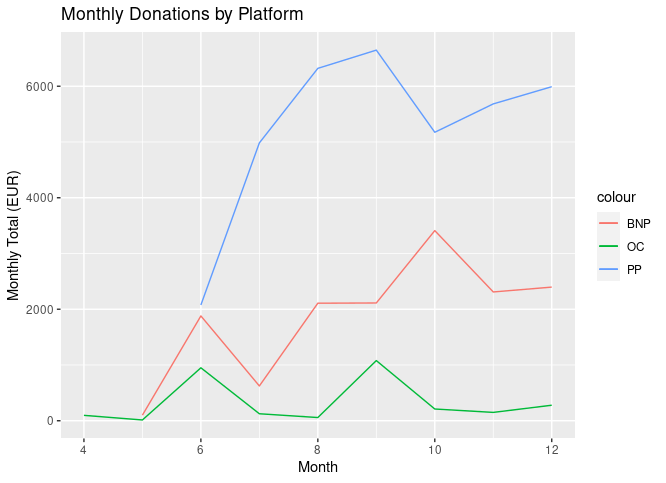

# FreeCAD Project Association 2022 Annual Report

## Message from the chair

The first full year of of operation for the [FreeCAD project association (FPA)](https://fpa.freecad.org) has been busy and full of achievements.  I am thrilled and optimistic for the future of the association.

The FPA was born out of the actions of a few veteran FreeCAD developers and community members. The majority of the FreeCAD community was not involved in its creation and initial set up, therefore, the FPA needed and still needs to gain trust and legitimacy from that community. We do this mainly through being transparent in everything the FPA does. This focus on transparency starts right from the [FPA statutes](https://fpa.freecad.org/handbook/corporate/statutes.html), which define the role of the FPA as a tool to be used by and to benefit the whole FreeCAD community.

It seemed simple.  After all, we have been working together for quite some time.  It turns out that operating in an official and accountable environment like the FPA, where you are literally handling other people's money, is not so simple.  Decisions become very important, as are the ways these decisions are made.  Everything needs to be transparent and justifiable.

We had some setbacks at first.  We realized our voting system was preventing us from moving forward, but we learned to solve the issues and put things back on track.  Now the FPA internals are really working well, and we are able to reach consensus very easily and quickly on most issues.

The administrators and members of the FPA would like to thank all of you who put trust in it right from the start, donated to the project, and helped FreeCAD to go further and faster. 

## 2022 Highlights

### Initial setup of the FPA

The FPA was formally created in November 2021 as a Belgium-based [AISBL](https://justice.belgium.be/fr/themes_et_dossiers/societes_associations_et_fondations/associations/aisbl) (international non-profit association)  It began operation in February 2022. The initial setup involved writing the association [statutes](https://fpa.freecad.org/handbook/corporate/statutes.html) and obtaining a [royal decree](https://fpa.freecad.org/royal_decree.pdf) that gave official birth to the association. The association was then [registered](https://kbopub.economie.fgov.be/kbopub/toonondernemingps.html?lang=en&ondernemingsnummer=781867807) and a bank account was opened. Accounts on different donation platforms where then also created, and the [FreeCAD website](https://freecad.org) was updated to inform users of the new donation possibilities.

Everything we learned about setting up and running an AISBL has been [documented](https://fpa.freecad.org/handbook/corporate/aisbl_guide.html). We hope this can help other Free and Open-Source (FOSS) projects to take a step further and create a formal structure for it.

### FPA Development Fund

The [FPA Development Fund](https://fpa.freecad.org/programs/fpadf-announcement) was established and made its first grant in September 2022. The fund provides grants to developers for work on the FreeCAD code base. A total of USD 2500 was awarded in 2022.

### The FreeCAD Blog

An [official FreeCAD blog](https://blog.freecad.org) was added to the main FreeCAD website in 2022. The blog provides insight into FreeCAD development, information about how people use FreeCAD and reaches community members beyond the [FreeCAD forum](https://forum.freecad.org).  A [grant program](https://fpa.freecad.org/programs/blog-content) for blog content was established in late 2022.  Community members can receive a small grant for creating original blog content

### Preparations for FOSDEM 2023

Meeting in real-life is something that is very important and fruitful, as any contributors to open-source projects who have experienced it will confirm. Many new ideas start during these meetings. It is also a kind of reward, after having worked together for a long time, it is always nice to put faces on names.

In 2022, the FPA was busy preparing for the [2023 Free and Open Source Developers’ European Meeting (FOSDEM)](https://fosdem.org).  Arrangements for a [FreeCAD meeting day](https://fpa.freecad.org/programs/freecad-day-2023) on the Friday immediately preceeding FOSDEM began late in 2022.

A [grant program](https://fpa.freecad.org/programs/fosdem-travel-grants) was established to help defray travel costs for attendees.

### Branding

The FPA acquired control of the [freecad.org](https://freecad.org) domain, which was generously donated to the FreeCAD community by the [KiCAD Services Corp.](https://www.kipro-pcb.com/). It also registered a FreeCAD [trademark](https://fpa.freecad.org/trademark.pdf).  These steps protect the FreeCAD brand.

### New members

The FPA [roster](https://fpa.freecad.org/handbook/people/roster.html) has expanded. More people have joined the FPA, and people have started assuming different roles or positions. So far the arrival of new members has been a spontaneous happening, without much regulation or direction, but as things ramp up, this is a question that is being put on the table to discuss.

### Administration team

The FPA administration team, expanded to 4 members in 2022, is now working at full power. We maintain a weekly video meeting and no week passes without several tasks being done. Everything we learn or set up is being documented in the [FPA handbook](https://fpa.freecad.org/handbook). The handbook covers everything about how the FPA is organized and operated. The handbook is a reference for people both inside and outside the FPA.

## Plans for 2023

We expect 2023 to be even busier than 2022.  Some of the things we hope to accomplish in 2023 are:

* Enable the FPA to engage in commercial operations and deduct VAT

* Hire an accountant to handle Belgian reporting requirements, such as tax returns

* Based on 2022 donations, expected income is USD 75000

* Expand the FPADF grant program (2000? 2500?)

* An expanded grants system for tasks proposed by the community, along the lines of the Google Summer of Code (GSOC) program

* Fund other specific projects (open contents, documentation...)

* Establish a reserve fund to protect against unplanned expenses

* Propose/develop a new documentation system

* Propose/develop a new parts library system

* Expand FPA to FreeCAD communities outside the forum

## Financial Report

In 2022, the FPA received donations in excess of **USD 50 000**, an amount that far exceeds our [expectations](https://fpa.freecad.org/budgets/2022.html). The donations came almost entirely from individuals, but a few companies also contributed. Most of our donations are small (~USD 5) one-time contributions.The largest part of the donations is also made of one-time small amounts (USD 5 or less).  A number of supporters have arranged for recurring donations, amounting to about **USD 600** per month.

In 2022, bookkeeping for the FPA was done in [simple table form](https://fpa.freecad.org/reports/2022). Starting in 2023, bookkeeping will be done in a more complete, double-entry system based on the open-source [GnuCash](https://gnucash.org/) application. Monthly reports will still be issued by the administration team.

* graphic: month by month, by platform

* graphic: individuals vs companies

* graphic: one-time versus recurring

* graphic: donations by amount

The FPA engaged in a few recurring engagements in 2022, namely subscriptions to services and platforms.

* table: recurring payments

### Debts

By the end of 2022, all debts related to the setup of the association were settled, and the FPA was completely debt free.

### Non-financial Assets

The FPA owns the [freecad.org](https://freecad.org) domain and and a [trademark](https://fpa.freecad.org/trademark.pdf) that helps us to protect the FreeCAD name and logo against unfair or malicious use.

### Financial Statements

* [Balance sheet](2022YearEndBalanceSheet.md)

* [Income statement](2022IncomeStatement.md)

### 2023 Budget Estimate

* Income
* Expenses
