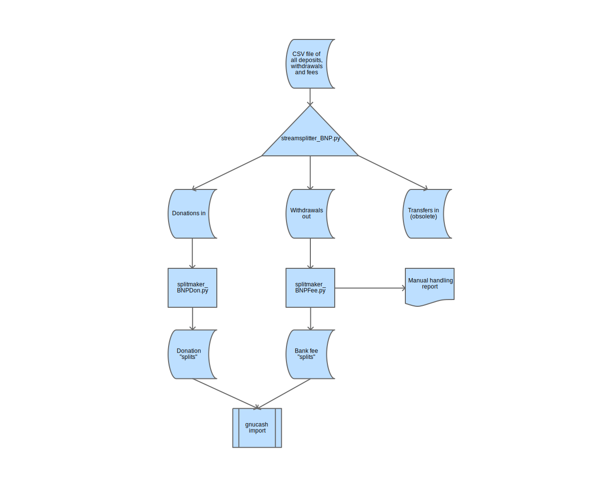

# Process for posting transactions on the BNP bank account to the FPA accounts.

## A csv file of transactions on the BNP account can be obtained from [Yorik] on request.  This file must be split into various types of transactions for posting:
* donations in (direct and Github), 
* periodic transfers in from PayPal, and,
* withdrawals out. These are split into:
    * bank fee transactions can be imported
    * other withdrawals need to be handled manually, a) to assign the correct accounts or b) because they have already been posted (ex FPADF grants)

## To separate BNP csv into donations in (direct and Github), transfers in from PayPal, withdrawals out, use the streamsplitter script:
    python3 streamsplitter_BNP.py BNP_test_TXIN.csv BNP_test_DonationTXOUT.csv BNP_test_TransferTXOUT.csv BNP_test_WithdrawalTXOUT.csv

### Sample output:
    streamsplitter_BNP input file: BNP_test_TXIN.csv
    streamsplitter_BNP donation output file: BNP_test_DonationTXOUT.csvo
    streamsplitter_BNP transfer output file: BNP_test_TransferTXOUT.csv
    streamsplitter_BNP withdrawal output file: BNP_test_WithdrawalTXOUT.csv
    streamsplitter_BNP records in: 22
    streamsplitter_BNP donation records out: 16
    streamsplitter_BNP transfer records out: 2
    streamsplitter_BNP withdrawal records out: 3

### The streamsplitter script produces intermediate transaction files with this layout:
    Data, Description, Amount, Type, TransactionNumber

## To build the double entry transactions for bank fees to be imported into gnuCash and identify withdrawals that need manual handling, use a splitmaker script:
    python3 splitmaker_BNPFee.py BNP_test_WithdrawalTXOUT.csv BNP_test_feeTXIMPORT.csv

### Sample output:
    splitmaker_BNPFee input file: BNP_test_WithdrawalTXOUT.csv
    splitmaker_BNPFee output file: BNP_test_feeTXIMPORT.csv
    splitmaker_BNPFee - record: 0 needs manual handling - amount: -509.68
    splitmaker_BNPFee records in: 3
    splitmaker_BNPFee records out: 4

## To build the double entry transactions for donations to be imported into gnuCash, use a splitmaker script:
    python3 splitmaker_BNPDon.py BNP_test_DonationTXOUT.csv BNP_test_donationTXIMPORT.csv

### Sample output:
    splitmaker_BNPDon input file: BNP_test_DonationTXOUT.csv
    splitmaker_BNPDon output file: BNP_test_donationTXIMPORT.csv

    splitmaker_BNPDon records in: 16
    splitmaker_BNPDon records out: 32

## To build the double entry transactions for balance transfers from PayPal to be imported into gnuCash, use a splitmaker script:
    python3 splitmaker_BNPPP.py BNP_test_TransferTXOUT.csv BNP_test_transferTXIMPORT.csv

### Sample output:
    splitmaker_BNPPP input file: BNP_test_TransferTXOUT.csv
    splitmaker_BNPPP output file: BNP_test_transferTXIMPORT.csv
    splitmaker_BNPPP records in: 2
    splitmaker_BNPPP records out: 4

The splitmaker scripts produce multiple line items for each intermediate transaction input.  Each line represents a change to a
single account.  These lines are called "splits" by gnuCash.

## Questions
- do we have to account for a PayPal cashout fee on transfers?  Or was that handled at donation time?

