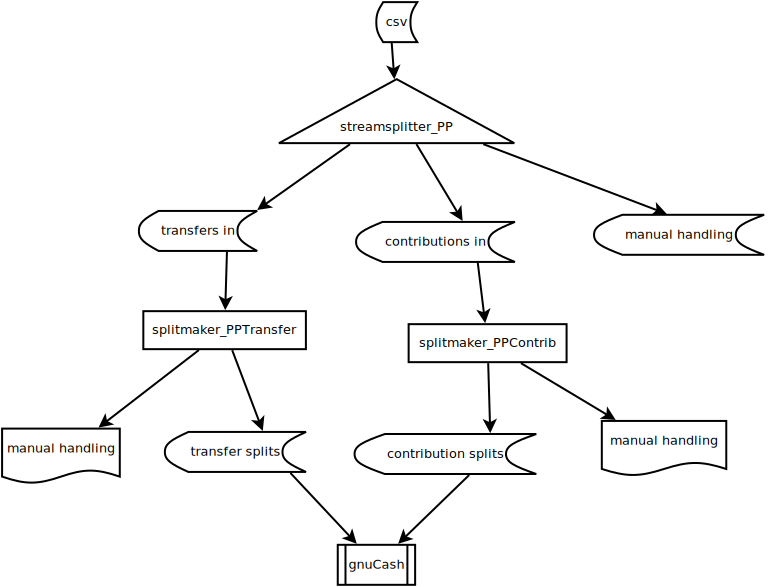

# Process for posting transactions on the PayPal account to the FPA accounts.

## To obtain a csv file of transactions on the FPA PayPal account:
* log in to the FPA PayPal account
* click "All Reports" at the top of the page
* click "Activity Report" on the left side menu
* select a date range and click "Create Report"
* a notice will be sent to your fpa.org email
* log in to the FPA PayPal account
* click "All Reports"
* select the csv file from the list of available downloads

## To build the double entry transactions for PayPal to be imported into gnuCash

### First, use the streamsplitter script:
    python3 streamsplitter_PP.py PayPal.csv PayPal_Donations.csv PayPal_Manuals.csv

This will produce two csv files from the input:
* donation transactions,
* transactions requiring manual intervention, which may include: 
    * transfers to/from the bank account
    * currency conversions
    * disputed items
    * reversals
    * anything else that the streamsplitter can not categorize.

### Second, use the splitmaker script:
    python3 splitmaker_PPContrib.py PayPal_Donations.csv PayPal_ContributionSplits.csv

The splitmaker scripts produce multiple line items for each transaction input.  Each line represents a change to a
single account (PayPal balance, fees expense, currency conversion, etc).  These lines are called "splits" by gnuCash.

The output from the splitmaker can be imported into gnuCash.

### Third, handle the exceptions:
The streamsplitter will report on any transactions that can not be identified as a donation.  These 
must be handled on a case by case basis.

