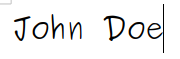

  <b>The FreeCAD project association</b> 
Rue Docteur Kuborn 31 / 46 
1070 Anderlecht 
Belgium 
<a href="https://freecad.org">https://freecad.org</a> 
<a href="mailto:fpa@freecad.org">fpa@freecad.org</a>

<h2 align=center>Donation receipt</h2>

The FreeCAD project association hereby acknowledges and expresses appreciation for your contribution to the development of FreeCAD. The donations of people, companies and institutions help the project to go further and faster.

We have received the following contribution:

* [**x**] Cash donation

* [  ] Donation of goods

* Value of the donation: **Currency Amount**

* Donation Received From: **Donor** 
                          Donor Address

* Date of Donation: **YYYY-MM-DD**

* Platform used: **Bank deposit/PayPal/**

The FreeCAD project association is an International Non-Profit Association (AISBL) seated in Belgium and ruled by Part III, Book 10 of the Code of Societies ans Associations under the Belgian law, and is registered as such under number [BE781867807](https://kbopub.economie.fgov.be/kbopub/toonondernemingps.html?lang=en&ondernemingsnummer=781867807).

Donation received by

**Receipt issuer name**, member, FreeCAD project association administration team

(Issue date)YYYY-MM-DD

