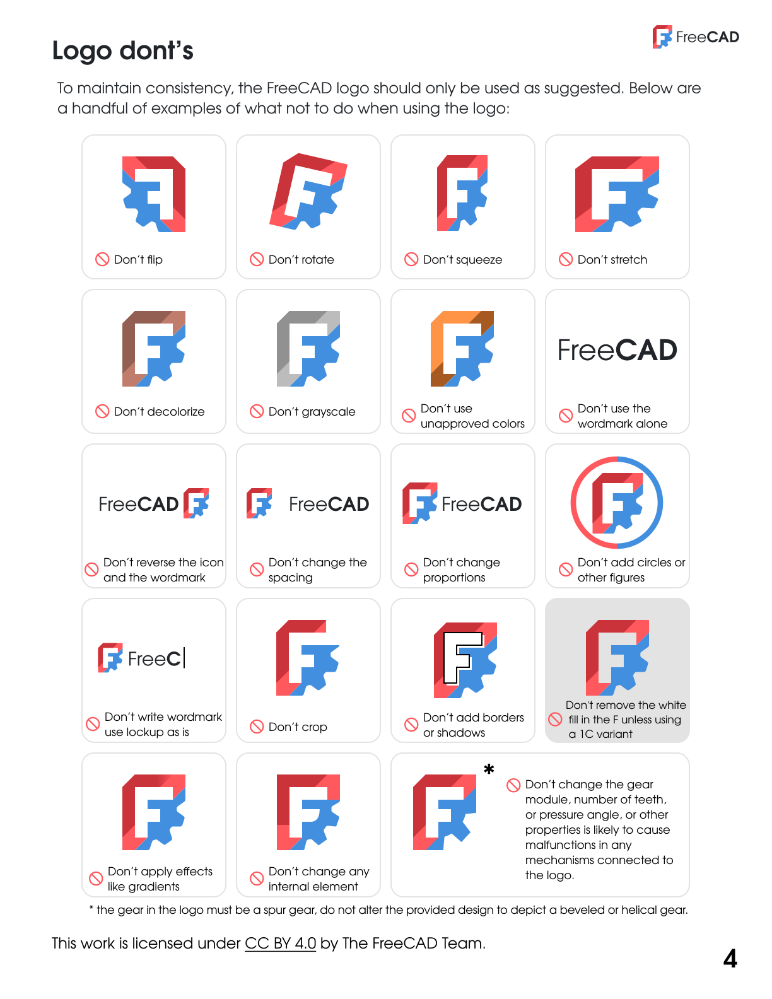

# {{page.title}}

{{page.description}}

This page provides comprehensive guidelines for properly referencing and using FreeCAD in various contexts, including books, commercial content, and other materials.

### Logo Kit

The logo is being used to brand and identify official FPA projects (FreeCAD) and content.
Third parties can only use it to provide credit for FreeCAD or to link to [freecad.org](http:/freecad.org).

You can download the logo kit including guidelines:

[Download Logo Kit](../../images/logos/logo_kit.zip){: .roundbutton .solobutton }

### Logos

#### Wordmark

The logo consists of two elements: the *F* symbol and the wordmark. The text uses the [Evolventa](https://evolventa.github.io/) font family, in regular weight for "Free" and in bold weight for "CAD". It should not be recreated but instead used as provided, either in the dark or light version.

#### Symbol

The symbol has two versions:
1. Full color (primary) which is the preferred version
2. Mono / 1C (secondary) as fallback and only used in the color *Tufts Blue*, *Light Red*, *Off Black*, or *White*. No other colors or gradients and effects should be used.

### Colors

The FreeCAD logos must always appear as one of the primary brand colors. This includes *Tufts Blue*, *Light Red*, *Dark Red*, *Off Black*, and *White*. These colors should also be used for other branded applications.
Regardless of the used symbol, the wordmark *FreeCAD* must always be used in either *Off Black* or *White* as provided in the logo kit.

[**Tufts Blue**, #418FDE, RGBA(65,143,222,1), CMYK(73,36,0,13), PMS 279 C](https://encycolorpedia.com/418fde){: .roundbutton .tuftsbluebutton }

[**Light Red**, #FF585D, RGBA(255,88,93,1), CMYK(0,64,64,0), PMS 178 C](https://encycolorpedia.com/ff585d){: .roundbutton .lightredbutton }

[**Dark Red**, #CB333B, RGBA(203,51,59,1), CMYK(0,75,72,18), PMS 1797 C](https://encycolorpedia.com/cb333b){: .roundbutton .darkredbutton }

[**Off Black**, #212529, RGBA(33,37,41,1), CMYK(0,0,16,82), PMS BLACK C](https://encycolorpedia.com/212529){: .roundbutton .offblackbutton }

### Uses

The FreeCAD logo is provided in several distinct flavors for the following applications:

* Primary (full color): the primary version of the logo should be used the majority of the time, on any background so long as it is clearly legible
* 1C (mono) in Off Black or White
* 1C (mono) in Tufts Blue or Light Red

Each of the 1C (mono) variants consists of one solid color, with the *F* as negative space. Use the provided symbols, do **not** fill the *F* with white, and always choose the version of the logo that achieves the most desirable contrast against the background and other elements in a given design.

When using other text elements in association with FreeCAD, use the [Evolventa](https://evolventa.github.io/) font family, but don't recreate the wordmark manually.

### Scale and whitespace

To retain legibility and integrity, the primary and secondary FreeCAD logo should be displayed not smaller than 32px and 16px, respectively.

To ensure that the logo is clearly visible in all applications, surround it with sufficient clear space.
It must be used with enough space around the logo and should not touch the borders of the image / application or other artwork elements and text.
Don't add text directly next to the logo and don't use a slogan next or under the wordmark.

When used with other logos and partner brands, all logos should be of equal size and have enough distance to each other.

### Don'ts

To maintain consistency, the FreeCAD logo should only be used as suggested above and provided in the logo kit.
You should **not** alter colors, shape, style, or apply any effects such as gradients, borders, shadows, or outlines.

We have made some examples of what **not** to do when using the logo:

### PDF Guidelines

Download the [FreeCAD brand guidelines](../../images/logos/guidelines/guidelines.pdf) as a PDF. These are also included in the logo kit at the top of the page.

## General FreeCAD Usage Guidelines

### Proper Reference

When referring to FreeCAD in any content, please use the following guidelines:

> You can use the FreeCAD logo when referring to the software project hosted at https://freecad.org, compiled from the source located at https://github.com/FreeCAD/FreeCAD, and digitally signed by The FreeCAD project association AISBL (where applicable). Any links or instructions on how to obtain the software should refer to the 'freecad.org' domain.

### Naming Conventions

- Use "FreeCAD" as a single word with capital "F" and "CAD"
- Do not use "Freecad", "freecad", "Free Cad", or other variations

### Attribution Requirements

- Include attribution to FreeCAD when using screenshots or featuring the software
- Provide links to https://freecad.org for downloads and official information
- When mentioning the source code, reference https://github.com/FreeCAD/FreeCAD
- For digitally signed releases, mention "The FreeCAD project association AISBL"

## Addons and Third-Party Content

### License Responsibility

FreeCAD does not dictate the licenses used by addon authors. Addons may have licenses or include graphics and assets that have licenses different from the main project.

**Important:** If you intend to use addons in your own FreeCAD related content, it is your responsibility to make sure you comply with the addon licenses.

### Best Practices for Addon Usage

- Always check the license of each addon before including it in your content
- Some addons may have commercial restrictions that differ from FreeCAD's license
- Provide proper attribution for addon authors as required by their licenses
- Include license information for all addons used in your documentation or books
- When in doubt, contact the addon author directly for clarification

### Finding Addon License Information

- Check the addon's documentation or README file
- Review the license files in the addon's repository
- Look for license headers in the source code
- Visit the addon's official page or repository for licensing details

## Frequently Asked Questions (FAQ)

### Can I use FreeCAD screenshots in my book?

Yes, you can use screenshots of FreeCAD in your book. FreeCAD is licensed under LGPL 2.0+, which generally allows for documentation and educational use.

### Do I need permission to write a book about FreeCAD?

No, you do not need special permission to write a book about FreeCAD. However, you should follow these guidelines. 

### Can I sell FreeCAD training courses or tutorials?

Yes, you can create and sell training courses about FreeCAD. The LGPL license allows for commercial educational content.

### How should I refer to FreeCAD in academic papers?

In academic papers, cite FreeCAD as "FreeCAD (version number), available from https://freecad.org". Include the version number you used and the official website URL.

### Can I modify the FreeCAD logo for my own use?

No, the FreeCAD logo should not be modified. Use the official logos as provided in the logo kit without alterations to colors, shapes, or styling.

### What if I need to use older versions of FreeCAD?

Older versions are available through the GitHub repository and may be archived on freecad.org. When referencing specific versions, always include the version number and download source.

### How do I handle multiple addons with different licenses?

You must comply with each addon's individual license requirements. This may mean providing different attributions, following different usage restrictions, or even excluding certain addons from commercial content.

### Can I bundle FreeCAD with my commercial software?

Yes, FreeCAD's LGPL license allows for distribution with commercial software, but you must comply with LGPL requirements, including making the source code available and including proper attribution and license notices.

### I'm selling my book/video/content.  Do I need to pay royalties?

No, you do not need to pay royalties to use FreeCAD in your content. However, FreeCAD is built and maintained by a community of volunteers.  Purely commercial ventures that don't respect this and don't try to "give back" to the community often face criticism and may lose community support.  Be a good citizen and consider how you can contribute back to the community.  Financial donations can be made to the FreeCAD project association AISBL.

## Additional Resources

- [FreeCAD Official Website](https://freecad.org)
- [FreeCAD Source Code](https://github.com/FreeCAD/FreeCAD)
- [FreeCAD Addon Repository](https://github.com/FreeCAD/FreeCAD-addons)
- [LGPL License Information](https://www.gnu.org/licenses/lgpl-2.1.html)

For specific questions not covered here, please contact the FreeCAD community through the official forums or GitHub discussions.

