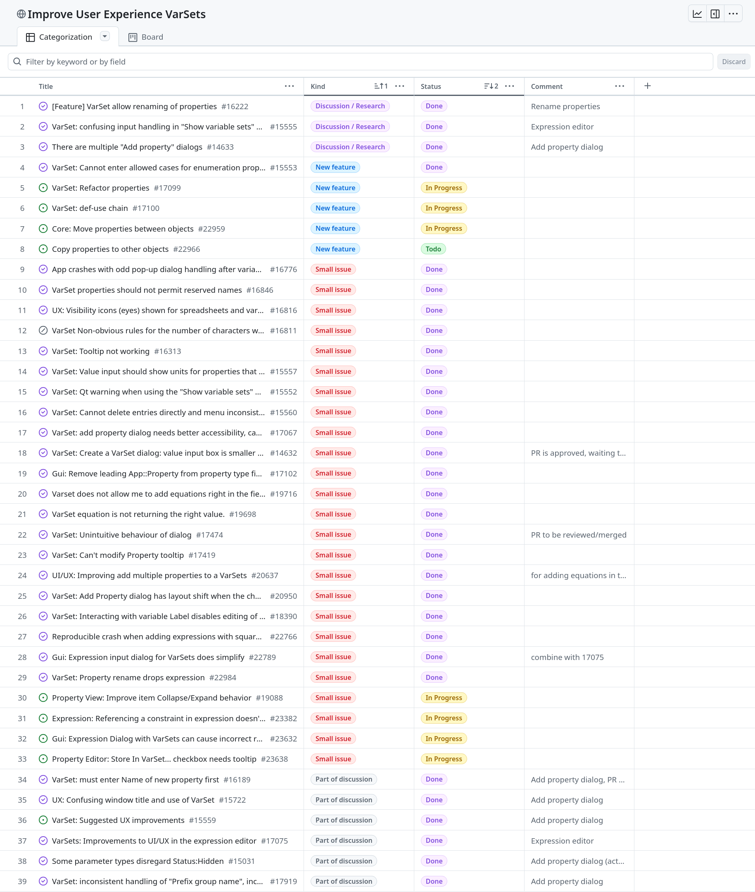

## Summary of Activities - VarSet User Experience - August 2025

### Renaming properties

Last month all comments were processed and the PR has merged together with a
bug fix.

- [#21976 (merged)](https://github.com/FreeCAD/FreeCAD/pull/21976)
- [#22985 (merged)](https://github.com/FreeCAD/FreeCAD/pull/22985)

### Improving the Expression dialog wrt VarSets

This has been merged:

- [#22944 (merged)](https://github.com/FreeCAD/FreeCAD/pull/22944)

### Fix problem with expressions

Last month this PR that fixes a problem with expressions was open but all
comments were processed.  It is now merged:

- [#22788 (merged)](https://github.com/FreeCAD/FreeCAD/pull/22788)

### Moving properties

I'm working on [refactoring properties](https://github.com/FreeCAD/FreeCAD/issues/17099) in particular on
how to move properties from one object to another.  This turns out to be very
challenging as explained in [this comment](https://github.com/FreeCAD/FreeCAD/pull/22960#issuecomment-3163514295).

I created a draft PR to discuss with `theo-vt` regarding transactions and I
have discussed this with `theo-vt` in a meeting.

- [#22960 (draft)](https://github.com/FreeCAD/FreeCAD/pull/22960)

### Reconcile Add Property dialogs

Remove the old Add Property dialog in favor of the one that is used for
VarSets.

- [#23426 (submitted)](https://github.com/FreeCAD/FreeCAD/pull/23426)

### Allow editing of a property tooltip in the Property View

This PR has been submitted and is under DWG review.

- [#23510 (submitted)](https://github.com/FreeCAD/FreeCAD/pull/23510)

## Current status as of 16 September 2025

[This project](https://github.com/orgs/FreeCAD/projects/30) is almost complete,
with most issues done and merged, all but one have PRs and the last one,
copying properties, depends on a discussion with the CQWG that is planning on
reviewing my solution on moving properties.

