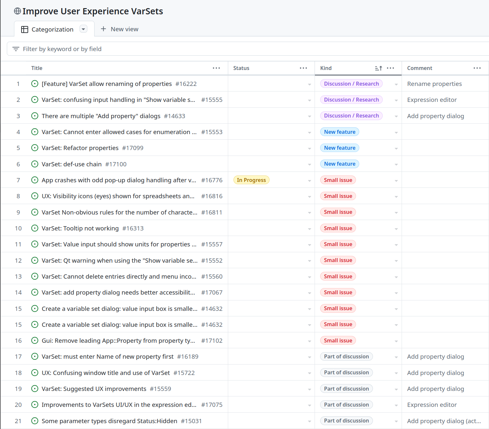
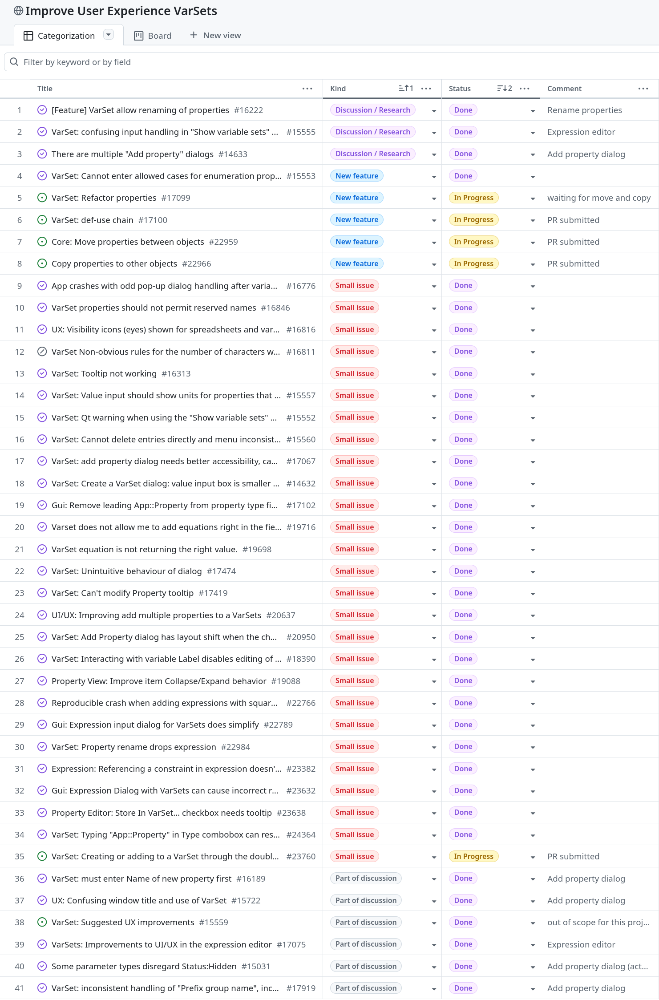

## Summary of Activities - VarSet User Experience - October 2025

With this report, I would like to finish this project.  Not all work has been
merged yet, but this is mainly caused by FreeCAD's current attention to bug
fixes for the 1.1 release.

### Pending feature PRs

#### Moving properties

The PR below has a satisfying solution, although I have some reservations
because it pushes the transaction system to the limit.  I brought this PR to
the attention of the CQWG and I propose this to merge it into the main branch
after the 1.1 release to validate the functionality before the next release.

- [#23841 (submitted)](https://github.com/FreeCAD/FreeCAD/pull/23841)

#### Copying properties

Along the same line, the PR below supports copying properties from one object
to another.

- [#24443 (submitted)](https://github.com/FreeCAD/FreeCAD/pull/24443)

#### Reporting where properties are being used

This PR allows users to obtain a report where properties are used (referred to)
in their designs.

- [#23989 (submitted)](https://github.com/FreeCAD/FreeCAD/pull/23989)

### Pending bug fixes

There is only one PR for the 1.1 release that solves the issue of an overload
of Python console messages:

- [#24446 (submitted)](https://github.com/FreeCAD/FreeCAD/pull/24446)

### Overview of performed tasks

When starting the project, this was an overview of issues to handle:

Currently, the state of the project is the following:

Besides the pending PRs described above, there is one issue that has not been
closed but is marked as done, because this issue needs wider discussion.  I
notified the Design Working Group of the issue.
